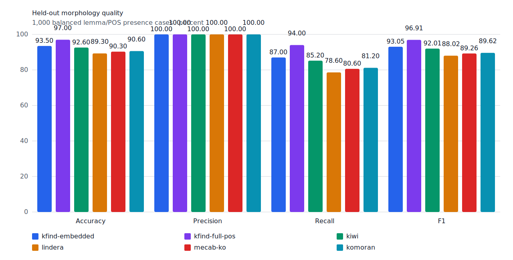
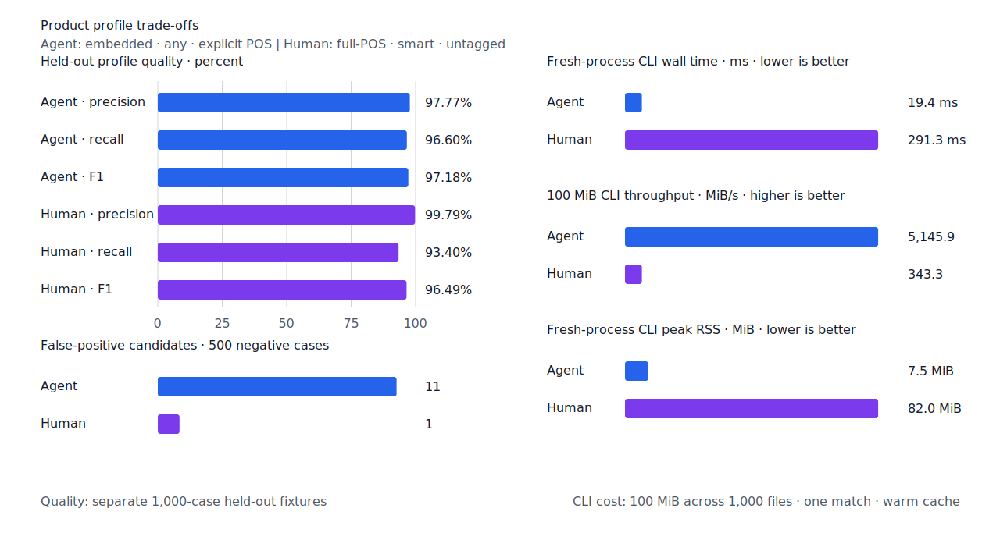

# 구조 증거로 줄인 검색 누락

- 측정일: 2026-07-17
- 기준 revision: `2b959f7cfac6da0e245acabb98895e3cedf146f4`
- 후보 revision: `9e72a5881adb2eca44c08045d17d013008925a58`
- 환경: Linux 6.12.76/aarch64, 10 logical CPUs, Python 3.12.13, Rust 1.97.0,
  Docker 29.6.1
- 반복: fresh process 1회 warm-up 뒤 5회 측정의 중앙값
- test fixture: `933bc12197da866d2363d7df9107d4d9be89a65ddaafd73968ad5384832b21ff`
- development fixture: `604c3a139854fcf59570392f48ab85028785f4a3561ea3c5e702f88b841f907c`
- hard-negative fixture: `1d8d34645a8517df473b749eea33177f81acc9782a9ba1a13f7742fa0277724a`
- 무품사 fixture: `94ccd70a093ee7af8435371b2ffdb81534ec97e29ada705ea72c940938d0c592`
- 100 MiB corpus: `7692072cb7bff9261c1fa5933bde41b27e558170818eeac6d07cabdd673815ff`
- 기준 report SHA-256: `12452b24ec819c0b1e416b8060b801ed196637947a2b49b8bb8e8ce626efcb19`
- 후보 report SHA-256: `5a9643b21afbff40c6a9c02451a9a9af2ee3cee36506c0a2ee232336595d361a`

## 결과

development에서만 규칙을 선택했다. 조사 없는 exact 체언 token은 token 경계 자체를 완성된
체언 근거로 사용한다. 축약 `-아/어` 뒤의 문자열은 compact resource가 `VX+어미`의 완전한
연쇄를 증명할 때만 predicate token으로 소비한다. 일반 용언을 보조용언으로 오인하지 않도록
연쇄의 첫 품사는 정확히 `VX`여야 한다.

| fixture/profile | 기준 TP / FP / FN | 후보 TP / FP / FN | 기준 recall | 후보 recall |
| --- | ---: | ---: | ---: | ---: |
| development embedded `smart` | 446 / 4 / 54 | 447 / 4 / 53 | 89.2% | 89.4% |
| development full-POS `smart` | 452 / 4 / 48 | 456 / 4 / 44 | 90.4% | 91.2% |
| test embedded `smart` | 435 / 0 / 65 | 435 / 0 / 65 | 87.0% | 87.0% |
| test full-POS `smart` | 466 / 0 / 34 | 470 / 0 / 30 | 93.2% | 94.0% |
| Human full-POS `smart` | 463 / 1 / 37 | 467 / 1 / 33 | 92.6% | 93.4% |
| Agent embedded `any` | 483 / 11 / 17 | 483 / 11 / 17 | 96.6% | 96.6% |

development full-POS precision은 99.12%에서 99.13%로 유지됐다. test full-POS precision은
100%이고 revised hard-negative의 strict FP 6건과 FPᶜ 1건은 변하지 않았다. 따라서 신규
contract FP는 0이다.

development에서 복구한 case는 다음 네 건이다.

| query | gold surface | 구조 근거 |
| --- | --- | --- |
| `n:선거운동` | `선거운동` | 조사 없는 exact 체언 token |
| `v:비추다` | `비춰볼` | 축약 `-어` 뒤 `VX+ETM` |
| `v:빼다` | `빼놓을` | 축약 `-어` 뒤 `VX+ETM` |
| `adj:크다` | `커지자` | 축약 `-어` 뒤 `VX+EF` |

고정 test에서는 `들려가는`, `빌려온`, `가져갈`, `알려져` 네 건이 함께 복구됐다. 이 결과는
규칙 선택에 사용하지 않고 회귀 확인에만 사용했다.



## 성능

각 값은 5회 중앙값이다. 증감은 기준 대비 후보이며 처리량은 높을수록, 나머지는 낮을수록 좋다.

| workload | metric | 기준 | 후보 | 증감 |
| --- | --- | ---: | ---: | ---: |
| embedded `smart` | initialization | 0.238162 s | 0.235944 s | -0.93% |
| embedded `smart` | cases/s | 9,467.5 | 9,421.8 | -0.48% |
| embedded `smart` | p95 | 0.2464 ms | 0.2479 ms | +0.61% |
| embedded `smart` | peak RSS | 41,712 KiB | 41,716 KiB | +0.01% |
| full-POS `smart` | initialization | 0.384246 s | 0.385801 s | +0.40% |
| full-POS `smart` | cases/s | 5,445.6 | 5,389.7 | -1.03% |
| full-POS `smart` | p95 | 0.6279 ms | 0.6322 ms | +0.68% |
| full-POS `smart` | peak RSS | 83,956 KiB | 84,020 KiB | +0.08% |
| Agent 100 MiB CLI | throughput | 5,390.85 MiB/s | 5,145.94 MiB/s | -4.54% |
| Human 100 MiB CLI | throughput | 333.48 MiB/s | 343.32 MiB/s | +2.95% |

모든 변화는 10% 경고선 안이다. full-POS `smart`는 Lindera 4.0.0의 고정 snapshot
15,609.1 cases/s보다 느리지만 recall은 94.0% 대 78.6%, peak RSS는 82.1 MiB 대
193.1 MiB다. 다음 성능 작업은 구조 판정의 호출 수와 할당을 profile한 뒤 품질 변경과 분리한다.



## 남은 FN

development full-POS FN 44건 중 `boundary-rejected`가 32건이다. 품사별로 명사 15건,
동사 7건, 형용사 5건, 수사 3건, 관형사 2건이다. 나머지는 `surface-missing` 6건,
`span-mismatch` 4건, `lexicon-missing` 2건이다. 다음 규칙은 같은 표면형의 대조군과 compact
component 경로로 구조를 증명한 뒤 선택한다. 조사 host를 일반적으로 여는 fallback이나
query별 표면형 목록은 추가하지 않는다.

## 재현

```console
git switch --detach 2b959f7cfac6da0e245acabb98895e3cedf146f4
KFIND_MORPH_IMAGE=kfind-morph-benchmark:recall-baseline \
scripts/benchmark-morphology.sh target/morph-recall-baseline

git switch --detach 9e72a5881adb2eca44c08045d17d013008925a58
KFIND_MORPH_IMAGE=kfind-morph-benchmark:structural-recall-final \
scripts/benchmark-morphology.sh target/morph-recall-structural-final

python3 tools/morph-compare/render_charts.py \
  target/morph-recall-structural-final/report.json docs/benchmarks/assets \
  --prefix 2026-07-17-structural-recall-

python3 tools/morph-compare/export_site_snapshot.py \
  target/morph-recall-structural-final/report.json docs/benchmarks/site-morphology.json \
  --revision 9e72a5881adb
```

외부 분석기 snapshot은 test fixture, adapter schema와 고정 버전·설정이 바뀌지 않아
갱신하지 않았다.
