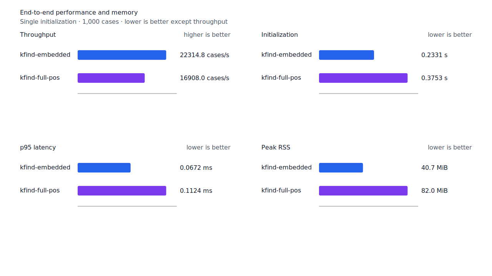
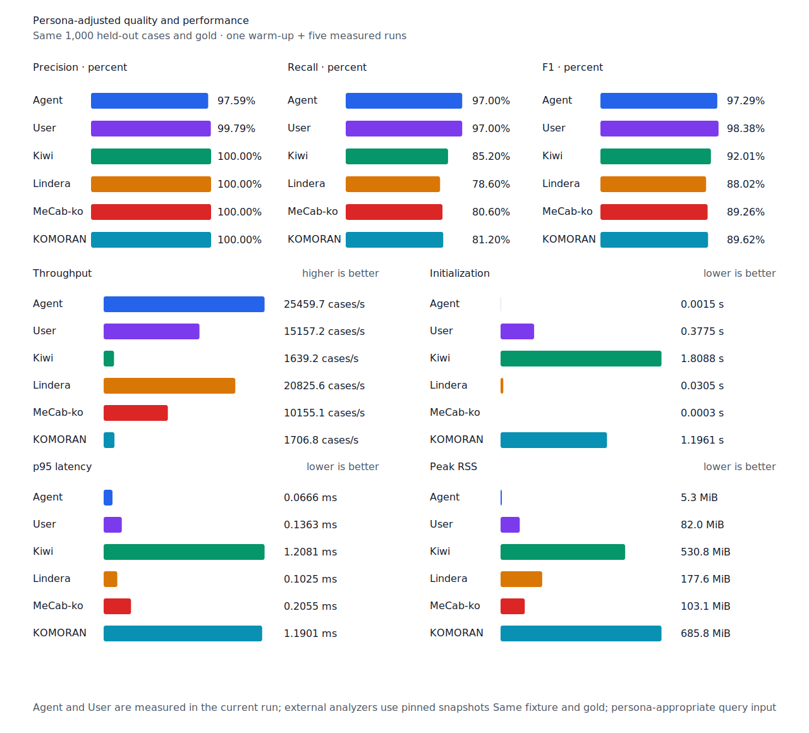

# whole 체언 내부 source component recall

- 측정일: 2026-07-17
- 최신 `origin/main` 및 기준 revision:
  `bbc4267b6bde5b1192e29deb2af2d8a492074be9`
- 후보 revision: `ac7d808158fef72789062060afe64111781a7fd6`
- 환경: Linux 6.12.76/linuxkit aarch64, 10 logical CPUs, Python 3.12.13,
  Rust 1.97.0, Docker 29.6.1
- 반복: fresh process warm-up 1회 뒤 5회 측정의 중앙값
- canonical test fixture:
  `933bc12197da866d2363d7df9107d4d9be89a65ddaafd73968ad5384832b21ff`
- canonical development fixture:
  `604c3a139854fcf59570392f48ab85028785f4a3561ea3c5e702f88b841f907c`
- explicit-POS matrix:
  `fbcce40b533655085ff8a4e9031559f99b54f86abe188b6ddc1d690dd44326c6`
- untagged matrix:
  `b9dd7601301fa19b35acba735a977eba7c56a0c9d67c65dee32db5c8028c71bb`
- development matrix:
  `bc67497c3dc966fb7453b238df52c6d781b1b4485d40e8a5d6a38104dcc7abed`
- hard-negative fixture:
  `f4d8829977ebfd061003724ee4aeb23b36dd901f6e46171c924a1f52a63f0ee5`
- 100 MiB corpus:
  `7692072cb7bff9261c1fa5933bde41b27e558170818eeac6d07cabdd673815ff`
- 기준 report SHA-256:
  `01c90704973430d06f484de92211278dcc14439385641178622d3a4df97649fc`
- 후보 report SHA-256:
  `d528cbd127652f6909d2382aae51750e8f51c28505b9c699012cf74974a1b1fa`

## 원인과 규칙

고정 source resource는 `자본주의/NNG` whole 분석과 정렬된 `자본/NNG + 주의/NNG`
component를 선언한다. 기존 구조 선택은 token 끝의 `의/JKG` 가능성 때문에 더 짧은
`자본주 + 의`를 조사 host로 선택했고, 선택된 host 밖의 `주의` component를 거부했다.

Whole 체언과 더 짧은 조사 host가 경쟁할 때 whole 분석이 직접 선언한 체언
`SourceComponent`를 추가 구조 근거로 유지한다. 비체언 component, runtime 분할, 큰 node의
substring과 component 경계를 가로지르는 span은 열지 않는다. Provenance는 기존 `Unit`에
비트로 합쳐 token별 보조 collection 할당을 만들지 않는다. Matrix contract 정의,
annotation과 gate는 변경하지 않았다.

## 품질과 contract 지표

`PNᶜ`는 contract-positive 분모 `TPᶜ + FNᶜ`다. 현재 canonical과 matrix의 reclassified
case는 0건이므로 strict와 contract-adjusted confusion matrix가 같다.

Canonical test와 development의 모든 profile은 기준과 같다. Test embedded/full-POS/Human의
`PNᶜ=500`, `FNᶜ`는 각각 53, 11, 15이고 Agent `FNᶜ`는 15다. Development
embedded/full-POS의 `PNᶜ=500`, `FNᶜ`는 45, 32다. FP와 FPᶜ도 변하지 않았다.

| matrix/profile | 기준 TPᶜ / FPᶜ / FNᶜ | 후보 TPᶜ / FPᶜ / FNᶜ | PNᶜ | recallᶜ | 모든 contract 질의 회수 |
| --- | ---: | ---: | ---: | ---: | ---: |
| test embedded `smart` | 1,262 / 5 / 139 | 1,263 / 5 / 138 | 1,401 | 90.08% → 90.15% | 342 → 343 / 468 |
| test full-POS `smart` | 1,347 / 5 / 54 | 1,348 / 5 / 53 | 1,401 | 96.15% → 96.22% | 417 → 418 / 468 |
| Human full-POS `smart` | 1,345 / 4 / 56 | 1,346 / 4 / 55 | 1,401 | 96.00% → 96.07% | 414 → 415 / 468 |
| Agent embedded `any` | 1,366 / 22 / 35 | 1,366 / 22 / 35 | 1,401 | 97.50% → 97.50% | 433 → 433 / 468 |
| development embedded `smart` | 1,234 / 7 / 157 | 1,234 / 7 / 157 | 1,391 | 88.71% → 88.71% | 327 → 327 / 466 |
| development full-POS `smart` | 1,291 / 8 / 100 | 1,291 / 8 / 100 | 1,391 | 92.81% → 92.81% | 373 → 373 / 466 |

세 smart profile은 `경쟁은 자본주의 때문에 ...`의 `주의` 1건만 회수했다. Agent `any`는
기존에도 surface를 반환했다. 새 FP·FPᶜ와 회귀는 없다. Hard-negative 결과도 기준과 같다.
Embedded는 strict `FP 4 / TN 34`, contract-adjusted
`TPᶜ 3 / FPᶜ 1 / TNᶜ 32 / FNᶜ 2`이고 full-POS는 strict `FP 6 / TN 32`,
contract-adjusted `TPᶜ 5 / FPᶜ 1 / TNᶜ 32 / FNᶜ 0`이다. `compound-substring`
slice의 contract-positive `대학교→학교`는 유지하고 나머지 5건은 계속 거부한다.


## 성능

모든 morphology 행은 같은 환경에서 fresh process warm-up 1회 뒤 5회 측정한
`median [min, max]`다. 모든 변화는 10% 회귀 경고선 안이다.

| workload | revision | initialization (s) | cases/s | p95 (ms) | RSS (KiB) |
| --- | --- | ---: | ---: | ---: | ---: |
| canonical embedded `smart` | 기준 | 0.233713 [0.232495, 0.242372] | 21,188.4 [20,108.1, 22,370.6] | 0.0701 [0.0662, 0.0728] | 41,664 [41,656, 41,668] |
| canonical embedded `smart` | 후보 | 0.233070 [0.232345, 0.233926] | 22,314.8 [22,258.8, 22,352.8] | 0.0672 [0.0667, 0.0675] | 41,664 [41,648, 41,676] |
| canonical full-POS `smart` | 기준 | 0.374913 [0.373949, 0.376646] | 16,645.5 [16,027.9, 16,866.9] | 0.1143 [0.1115, 0.1197] | 83,960 [83,952, 83,964] |
| canonical full-POS `smart` | 후보 | 0.375284 [0.373876, 0.436194] | 16,908.0 [15,416.5, 17,003.5] | 0.1124 [0.1105, 0.1259] | 83,960 [83,948, 83,964] |
| canonical Agent `any` | 기준 | 0.001430 [0.001420, 0.001496] | 26,789.8 [26,112.8, 26,864.5] | 0.0620 [0.0611, 0.0640] | 5,396 [5,388, 5,400] |
| canonical Agent `any` | 후보 | 0.001516 [0.001416, 0.001601] | 25,459.7 [25,048.9, 25,571.9] | 0.0666 [0.0651, 0.0678] | 5,392 [5,388, 5,396] |
| canonical Human `smart` | 기준 | 0.379911 [0.378434, 0.391838] | 15,191.4 [15,152.2, 15,321.6] | 0.1333 [0.1315, 0.1360] | 83,984 [83,936, 84,016] |
| canonical Human `smart` | 후보 | 0.376569 [0.375580, 0.386091] | 15,281.8 [14,159.7, 15,393.2] | 0.1332 [0.1322, 0.1408] | 83,984 [83,976, 83,984] |
| matrix Agent `any` | 기준 | 0.001478 [0.001409, 0.001544] | 26,170.1 [25,807.0, 26,433.6] | 0.0644 [0.0632, 0.0658] | 8,496 [8,480, 8,500] |
| matrix Agent `any` | 후보 | 0.001423 [0.001420, 0.001517] | 27,630.7 [27,251.2, 27,662.3] | 0.0605 [0.0595, 0.0611] | 8,500 [8,492, 8,504] |
| matrix Human `smart` | 기준 | 0.376149 [0.374647, 0.387225] | 15,910.8 [14,895.0, 16,010.5] | 0.1369 [0.1351, 0.1451] | 84,712 [84,708, 84,716] |
| matrix Human `smart` | 후보 | 0.380504 [0.375771, 0.412778] | 15,376.0 [14,850.2, 15,907.7] | 0.1394 [0.1387, 0.1461] | 84,712 [84,704, 84,716] |

중앙값 기준 canonical embedded/full-POS/Agent/Human cases/s 변화는 각각 +5.32%, +1.58%,
-4.96%, +0.60%다. Matrix Agent와 Human은 +5.58%, -3.36%다. 100 MiB CLI 처리량은
Agent 6,033.27→5,853.64 MiB/s(-2.98%), Human 349.76→349.76 MiB/s(+0.00%)다.

동일 canonical fixture의 후보 Agent는 25,459.7 cases/s로 Lindera 4.0.0 고정 snapshot의
20,825.6 cases/s보다 22.25% 빠르다. recallᶜ는 97.0% 대 78.6%, peak RSS는
5.3 MiB 대 177.6 MiB다.





## 남은 FN

Canonical test full-POS의 `PNᶜ`는 500, `FNᶜ`는 11이다. Matrix full-POS의 `PNᶜ`는
1,401, `FNᶜ`는 53이다. 함께 조사한 나머지 표준형은 같은 원인이 아니다.

- `1년간→간`: ASCII 숫자와 `NNBC` 뒤 nominal tail을 현재 선호 path가 완성하지 않는다.
- `어느날→날`: `MM + NNG` path를 현재 nominal-only 선호 path가 제외한다.
- `첫번째로→번째`: query span이 `번/NNBC + 째/XSN` 경계를 가로지르므로 exact component
  계약으로 열지 않는다.

다음 recall 작업은 `1년간→간`과 `어느날→날`을 각각 hard-negative와 대조해 더 큰 typed
표준 구조를 고른다. 서로 독립된 구조를 하나의 예외로 합치지 않는다.

## 재현

```console
git switch --detach ac7d808158fef72789062060afe64111781a7fd6
KFIND_MORPH_IMAGE=kfind-morph-benchmark:nominal-component-candidate-ac7d808 \
KFIND_MORPH_RUNS=5 \
scripts/benchmark-morphology.sh target/morph-nominal-component-candidate-ac7d808

git switch --detach bbc4267b6bde5b1192e29deb2af2d8a492074be9
KFIND_MORPH_IMAGE=kfind-morph-benchmark:nominal-component-base-bbc4267 \
KFIND_MORPH_RUNS=5 \
scripts/benchmark-morphology.sh target/morph-nominal-component-base-bbc4267

python3 tools/morph-compare/render_charts.py \
  target/morph-nominal-component-candidate-ac7d808/report.json \
  docs/benchmarks/assets \
  --prefix 2026-07-17-whole-nominal-component-recall-

python3 tools/morph-compare/export_site_snapshot.py \
  target/morph-nominal-component-candidate-ac7d808/report.json \
  docs/benchmarks/site-morphology.json \
  --revision ac7d808158fef72789062060afe64111781a7fd6
```

외부 분석기 snapshot은 fixture, adapter schema와 고정 버전·설정이 바뀌지 않아 갱신하지
않았다.
