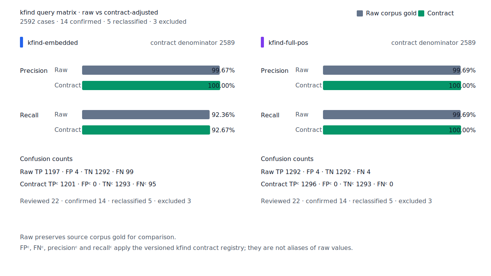
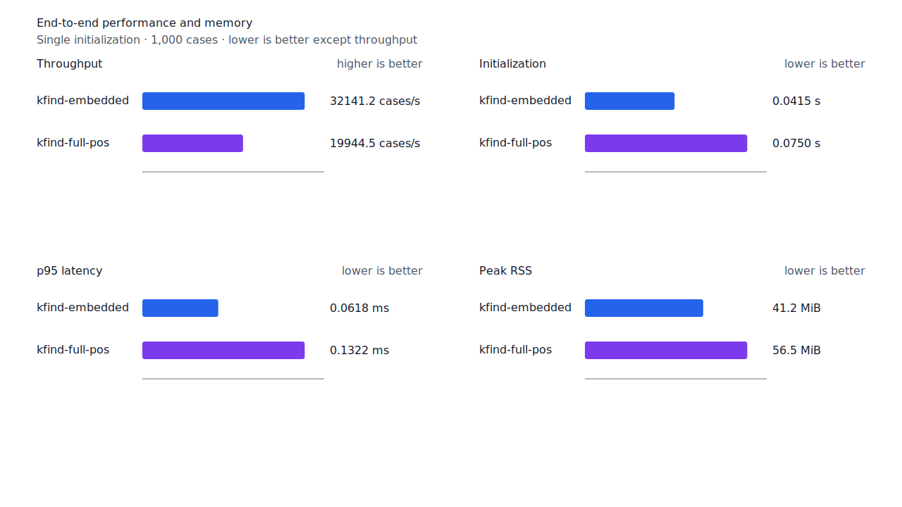
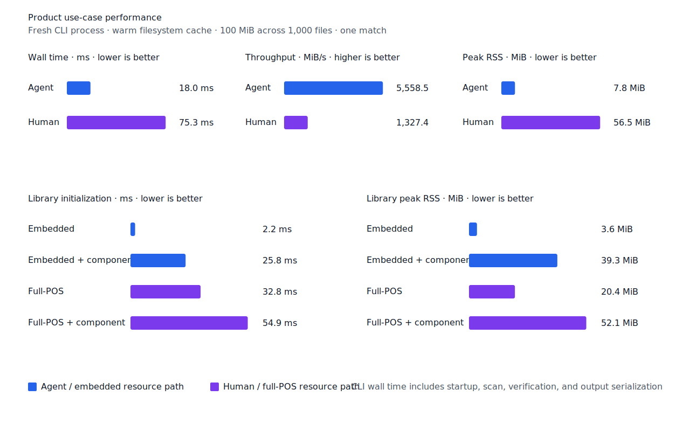

# 명사 결합 접미사 recall

- 측정일: 2026-07-18
- 기준 revision: `f22e44f8e6c86ba15627f09d4399038e79a1a4eb`
- 후보 코드 revision: `7cbd4796a89f5bdaf03b1816b428a7f0f2f30848`
- 환경: Linux 6.12.76/linuxkit aarch64, 10 logical CPUs, Python 3.12.13,
  Rust 1.97.0, Docker 29.6.1
- 반복: fresh process warm-up 1회 뒤 5회 측정의 중앙값과 min/max
- canonical fixture:
  `1497b958a6970c55bc68ff148e435a88366b650c971231c3ae40adb9d8c46572`
- explicit-POS matrix:
  `e862d8af010c23462ba3a9ebf4f1134275b68de5004bc60035565734f5f19999`
- contract review registry:
  `3aa7f3be5dc4a9f0c44a18c0bde4a570b790c9372271cd15eb05e149d3a3e50e`
- 기준 report SHA-256:
  `f3b9c14a584660678737f919d2c64c634032f7eaece5ee2460c054d8d81c018c`
- 후보 report SHA-256:
  `6c2aea77e0d03f10c4284c55ffbba5429794a5b332f7febc7c955f1599938280`

## 결론

`하→책임하에서`를 회수해 test query matrix full-POS raw FN을 5→4,
FNᶜ를 1→0으로 줄였다. Raw FP 4와 FPᶜ 0은 유지했고 recallᶜ는
99.92%→100%다. Embedded와 무품사 Human matrix도 같은 문장의 query 한 건만
회수했으며 canonical, development, hard-negative와 Robust 품질은 변하지 않았다.

Matcher는 기존 `하` 후보를 한 번만 만들고 `smart` 구조 검증에서 완성된
`책임/NNG + 하/NNG + 에서/JKB` 경로를 확인한다. `하/JKV` 동형 경로가 먼저
선택되더라도 다른 완전 경로를 검증한다. 후보 생성기와 검증기를 별도 파이프라인으로
분리하거나 후보를 다시 생성하지 않는다.

## 사전과 구조 판정

한국어기초사전과 표준국어대사전의 고정 snapshot이 모두 현대 접사 `-하`를 등재한
경우만 검토 catalog에 남겼다. 우리말샘은 추가 provenance로만 기록한다. 생성기는 고정
snapshot을 한 번 읽어 reusable catalog candidate를 만들고, 별도 installer의 validator가
같은 candidate의 schema·출처 합의와 승인된 표면 집합을 검사한다. 검증 정책만 바뀌면
candidate를 다시 생성하지 않는다. Runtime은 이 catalog를 후보 생성 규칙이 아니라 구조
검증 어휘로 사용한다.

`smart` 명사 match는 다음 조건을 모두 요구한다.

- query가 한 음절 보통명사이고 조사 continuation을 갖는다.
- token 왼쪽부터 query 앞까지 완전한 체언 경로가 있다.
- query span 뒤부터 token 끝까지 완전한 조사 경로가 있다.
- token 시작부터 query 끝까지 별도 whole 분석이 query를 내부 substring으로 덮지 않는다.
- query 표면이 검토한 NIKL 명사 결합 접미사 catalog에 있다.

따라서 `책임하에서`의 byte `26..29`인 `하`를 반환하되, `책임하`처럼 조사가 없는
표면과 `빙원옆에`의 일반 명사 tail은 거부한다. 이 규칙은 명사 continuation에만 적용해
`그래 네가 가.`에서 `가다` query가 마지막 byte `14..17`의 독립 명령형 `가`를 반환하는
기존 동작을 보존한다.

## 품질

| fixture/profile | 기준 TP / FP / TN / FN | 후보 TP / FP / TN / FN | precision | recall |
| --- | ---: | ---: | ---: | ---: |
| canonical embedded smart | 461 / 1 / 499 / 39 | 461 / 1 / 499 / 39 | 99.78% → 99.78% | 92.20% → 92.20% |
| canonical full-POS smart | 498 / 2 / 498 / 2 | 498 / 2 / 498 / 2 | 99.60% → 99.60% | 99.60% → 99.60% |
| development full-POS smart | 485 / 2 / 498 / 15 | 485 / 2 / 498 / 15 | 99.59% → 99.59% | 97.00% → 97.00% |
| test matrix embedded smart | 1,196 / 4 / 1,292 / 100 | 1,197 / 4 / 1,292 / 99 | 99.67% → 99.67% | 92.28% → 92.36% |
| test matrix full-POS smart | 1,291 / 4 / 1,292 / 5 | 1,292 / 4 / 1,292 / 4 | 99.69% → 99.69% | 99.61% → 99.69% |
| test matrix Human smart | 1,285 / 6 / 1,290 / 11 | 1,286 / 6 / 1,290 / 10 | 99.54% → 99.54% | 99.15% → 99.23% |
| hard-negative full-POS smart | 0 / 6 / 33 / 0 | 0 / 6 / 33 / 0 | n/a (84.62% 유지) | n/a |
| Robust explicit-POS full-POS | 204 / 1 / 249 / 46 | 204 / 1 / 249 / 46 | 99.51% → 99.51% | 81.60% → 81.60% |

Test matrix contract 값은 `TPᶜ/FPᶜ/TNᶜ/FNᶜ 1,295/0/1,293/1`에서
`1,296/0/1,293/0`으로 바뀌었다. 잔여 raw FN 4건은 disposition ledger와 대조해
`gold-alignment-error 1`, `nonstandard-input 3`, 미분류 0건을 확인했다. 제거된 FN은
`matrix:pos:ud-korean-kaist:MH2_0190-s23:3` 하나다.




## 성능

| workload/지표 | 기준 median [min, max] | 후보 median [min, max] | 변화 |
| --- | ---: | ---: | ---: |
| canonical full-POS initialization | 0.075709 s [0.075505, 0.079371] | 0.075035 s [0.074192, 0.076694] | -0.89% |
| canonical full-POS cases/s | 19,638.2 [17,827.7, 20,164.9] | 19,944.5 [18,972.5, 20,375.8] | +1.56% |
| canonical full-POS p95 | 0.1330 ms [0.1288, 0.1485] | 0.1322 ms [0.1303, 0.1402] | -0.60% |
| canonical full-POS RSS | 57,856 KiB [57,840, 57,916] | 57,848 KiB [57,792, 57,916] | -0.01% |
| matrix full-POS cases/s | 19,389.1 [17,850.1, 20,583.2] | 19,750.3 [18,304.6, 20,707.4] | +1.86% |
| matrix full-POS p95 | 0.1339 ms [0.1275, 0.1437] | 0.1332 ms [0.1273, 0.1428] | -0.52% |
| canonical Human cases/s | 17,245.9 [16,478.9, 18,376.8] | 18,226.6 [17,800.1, 18,434.1] | +5.69% |
| canonical Human p95 | 0.1469 ms [0.1400, 0.1490] | 0.1394 ms [0.1390, 0.1429] | -5.11% |
| matrix Human cases/s | 16,765.4 [16,087.3, 17,912.7] | 17,768.5 [16,937.7, 18,160.6] | +5.98% |
| matrix Human p95 | 0.1556 ms [0.1450, 0.1628] | 0.1452 ms [0.1432, 0.1527] | -6.68% |
| full-POS+component startup | 0.057217 s [0.056072, 0.058435] | 0.054873 s [0.054652, 0.055352] | -4.10% |
| 100 MiB Agent CLI throughput | 5,566.00 MiB/s [5,022.92, 5,841.35] | 5,558.50 MiB/s [5,188.09, 5,602.87] | -0.13% |
| 100 MiB Human CLI throughput | 1,329.65 MiB/s [1,321.29, 1,340.08] | 1,327.35 MiB/s [1,297.24, 1,384.07] | -0.17% |

CLI 중앙값의 -0.17% 이하는 측정 범위가 겹치며, runner와 startup 지표도 회귀가 없다. 품질
회수에 필요한 검증은 match된 한 음절 명사와 조사 continuation에만 실행된다.

동일 runtime tree의 선행 측정 한 번에서는 Agent와 Human CLI 처리량이 각각 -6.80%,
-5.12%였다. 새 검증을 실행하지 않는 `embedded + any` Agent도 함께 느려진 결과라 시스템
변동으로 보고 재측정했다. 위 표와 site snapshot은 최종 구현 revision의 확인 report를 사용한다.





## 재현

```console
git switch --detach f22e44f8e6c86ba15627f09d4399038e79a1a4eb
KFIND_MORPH_RUNS=5 scripts/benchmark-morphology.sh target/pr7-baseline-report

git switch --detach 7cbd4796a89f5bdaf03b1816b428a7f0f2f30848
KFIND_MORPH_RUNS=5 scripts/benchmark-morphology.sh target/pr7-separated-report

python3 tools/morph-compare/validate_fnc_dispositions.py \
  target/pr7-separated-report/report.json \
  docs/benchmarks/query-matrix-fnc-dispositions.tsv

python3 tools/morph-compare/render_charts.py \
  target/pr7-separated-report/report.json \
  docs/benchmarks/assets \
  --prefix 2026-07-18-attached-nominal-suffix-

python3 tools/morph-compare/export_site_snapshot.py \
  target/pr7-separated-report/report.json \
  docs/benchmarks/site-morphology.json \
  --revision 7cbd4796a89f5bdaf03b1816b428a7f0f2f30848
```
