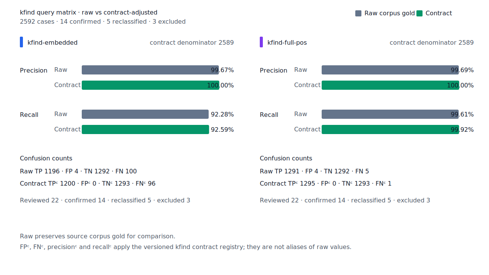
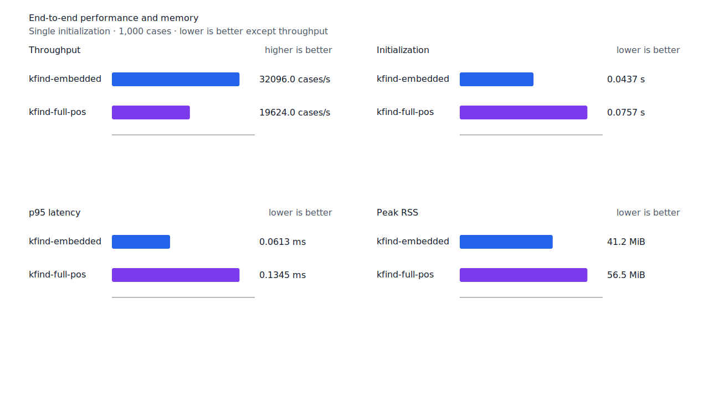
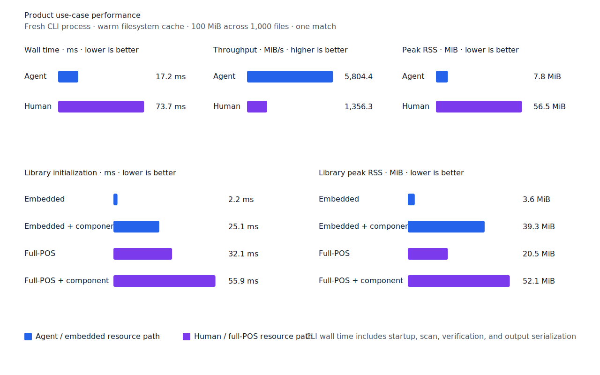

# 소실 지정사 축약 recall

- 측정일: 2026-07-18
- 기준 revision: `b479ec341513ac0d7fed5d3ba8bb27b8fecd2078`
- 후보 코드 revision: `6a70159ac3c511ac48e1d7e7994b6b480a5bce50`
- 환경: Linux 6.12.76/linuxkit aarch64, 10 logical CPUs, Python 3.12.13,
  Rust 1.97.0, Docker 29.6.1
- 반복: fresh process warm-up 1회 뒤 5회 측정의 중앙값과 min/max
- canonical fixture:
  `1497b958a6970c55bc68ff148e435a88366b650c971231c3ae40adb9d8c46572`
- explicit-POS matrix:
  `e862d8af010c23462ba3a9ebf4f1134275b68de5004bc60035565734f5f19999`
- contract review registry:
  `3aa7f3be5dc4a9f0c44a18c0bde4a570b790c9372271cd15eb05e149d3a3e50e`
- 기준 report SHA-256:
  `871c983eaca0b98f619cee21fa69887d157fa8e45cd2b1929137c10962c6a90c`
- 후보 report SHA-256:
  `ae07705b1050c3b8c5a47023b7f1cb9a4b8158d4181d8ee43c4ebf7c5e842e4f`

## 결론

`이다→걸까`를 회수해 test query matrix full-POS raw FN을 6→5, FNᶜ를
2→1로 줄였다. Raw FP 4와 FPᶜ 0은 유지했고 recallᶜ는 99.85%→99.92%다.
Embedded와 무품사 Human matrix도 같은 문장의 query 한 건만 회수했으며 canonical,
development, hard-negative와 Robust 품질은 변하지 않았다.

Query compiler는 `smart` 지정사 query에 선언된 `걸까` anchor 하나만 추가한다. Matcher는
anchor hit의 exact source가 `체언+ + VCP + E+`이고 `EC` 또는 `EF`로 끝나며 정렬된
`VCP` component span은 없을 때만 축약 anchor 전체를 반환한다. 어절 전체 후보 열거는
사용하지 않는다.

## 구조 판정

목표 문장은 `아니면 주변 어디에 남아있는 걸까?`, query는 `이다`, gold는 byte
`40..46`의 `걸까`다. Source에는 다음 두 분석이 있다.

```text
것/NNB + 이/VCP + ᆯ까/EC
것/NNB + 이/VCP + ᆯ까/EF
```

축약으로 `VCP`만의 양의 byte span을 만들 수 없으므로 결과를 임의의 부분 span으로
추정하지 않고 `걸까` 전체로 반환한다. 정렬된 `VCP` span이 있는 일반 활용,
`NNB+VCP+ETM`, `NNB+VCP+EC+VCP`와 체언 host가 없는 분석은 거부한다. `token`과
`any`에는 이 문법 anchor를 만들지 않는다.

`걸까`는 검토한 KRDICT·STDICT·OPENDICT snapshot의 exact headword가 아니다. 따라서
사전 표제어 확장이 아니라 문법 축약 대응과 source 구조 검증으로 처리했다.

## 품질

| fixture/profile | 기준 TP / FP / TN / FN | 후보 TP / FP / TN / FN | precision | recall |
| --- | ---: | ---: | ---: | ---: |
| canonical embedded smart | 461 / 1 / 499 / 39 | 461 / 1 / 499 / 39 | 99.78% → 99.78% | 92.20% → 92.20% |
| canonical full-POS smart | 498 / 2 / 498 / 2 | 498 / 2 / 498 / 2 | 99.60% → 99.60% | 99.60% → 99.60% |
| development full-POS smart | 485 / 2 / 498 / 15 | 485 / 2 / 498 / 15 | 99.59% → 99.59% | 97.00% → 97.00% |
| test matrix embedded smart | 1,195 / 4 / 1,292 / 101 | 1,196 / 4 / 1,292 / 100 | 99.67% → 99.67% | 92.21% → 92.28% |
| test matrix full-POS smart | 1,290 / 4 / 1,292 / 6 | 1,291 / 4 / 1,292 / 5 | 99.69% → 99.69% | 99.54% → 99.61% |
| test matrix Human smart | 1,284 / 6 / 1,290 / 12 | 1,285 / 6 / 1,290 / 11 | 99.53% → 99.54% | 99.07% → 99.15% |
| hard-negative full-POS smart | 0 / 6 / 33 / 0 | 0 / 6 / 33 / 0 | n/a (84.62% 유지) | n/a |
| Robust explicit-POS full-POS | 204 / 1 / 249 / 46 | 204 / 1 / 249 / 46 | 99.51% → 99.51% | 81.60% → 81.60% |

Test matrix contract 값은 `TPᶜ/FPᶜ/TNᶜ/FNᶜ 1,294/0/1,293/2`에서
`1,295/0/1,293/1`로 바뀌었다. 잔여 raw FN 5건은 disposition ledger와 대조해
`structural-redesign 1`, `gold-alignment-error 1`, `nonstandard-input 3`, 미분류 0건을
확인했다. 제거된 FN은
`matrix:pos:ud-korean-kaist:MH2_0010-s330:2` 하나다.




## 성능

전체 token을 지정사 후보로 여는 설계는 canonical full-POS 처리량을 9.99%, Human
처리량을 6.15% 낮춰 채택하지 않았다. 최종 구현은 query plan에 축약 anchor 하나를 추가하고
그 anchor hit에서만 source 구조를 조회한다.

| workload/지표 | 기준 median [min, max] | 후보 median [min, max] | 변화 |
| --- | ---: | ---: | ---: |
| canonical full-POS initialization | 0.074088 s [0.073334, 0.075765] | 0.075651 s [0.074973, 0.077699] | +2.11% |
| canonical full-POS cases/s | 20,257.4 [19,601.2, 20,337.2] | 19,624.0 [18,037.0, 20,004.7] | -3.13% |
| canonical full-POS p95 | 0.1303 ms [0.1294, 0.1335] | 0.1345 ms [0.1314, 0.1424] | +3.22% |
| canonical full-POS RSS | 57,844 KiB [57,844, 57,900] | 57,844 KiB [57,828, 57,912] | 0.00% |
| canonical Human cases/s | 18,235.8 [17,832.0, 18,521.1] | 17,841.9 [17,583.3, 18,475.7] | -2.16% |
| canonical Human p95 | 0.1402 ms [0.1369, 0.1420] | 0.1413 ms [0.1385, 0.1422] | +0.78% |
| matrix Human cases/s | 18,036.3 [17,848.9, 18,191.7] | 17,696.7 [16,882.9, 18,154.2] | -1.88% |
| matrix Human p95 | 0.1442 ms [0.1433, 0.1462] | 0.1486 ms [0.1422, 0.1526] | +3.05% |
| full-POS+component startup | 0.056131 s [0.054700, 0.056483] | 0.055895 s [0.055474, 0.057005] | -0.42% |

후보의 저하와 개선은 workload별로 방향이 다르고 측정 범위가 겹친다. 품질 목표를 좁게
회수하면서 경고선 안에 있으므로 최종 구조를 채택한다.





## 재현

```console
git switch --detach b479ec341513ac0d7fed5d3ba8bb27b8fecd2078
KFIND_MORPH_RUNS=5 scripts/benchmark-morphology.sh target/pr6-baseline-report

git switch --detach 6a70159ac3c511ac48e1d7e7994b6b480a5bce50
KFIND_MORPH_RUNS=5 scripts/benchmark-morphology.sh target/pr6-targeted-rerun-report

python3 tools/morph-compare/validate_fnc_dispositions.py \
  target/pr6-targeted-rerun-report/report.json \
  docs/benchmarks/query-matrix-fnc-dispositions.tsv

python3 tools/morph-compare/render_charts.py \
  target/pr6-targeted-rerun-report/report.json \
  docs/benchmarks/assets \
  --prefix 2026-07-18-copula-lost-span-
```
