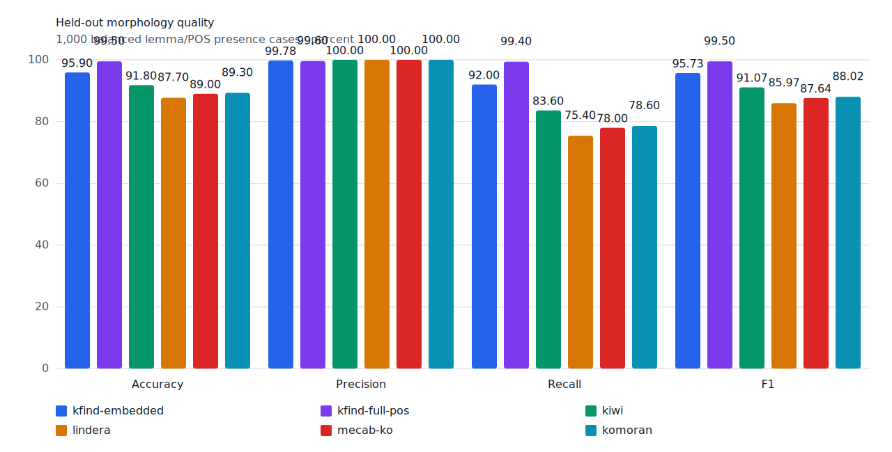
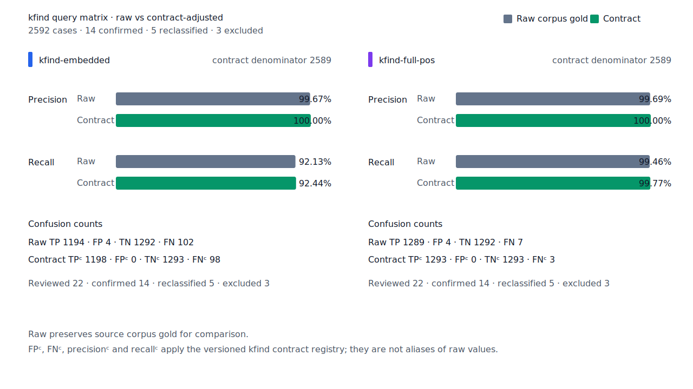
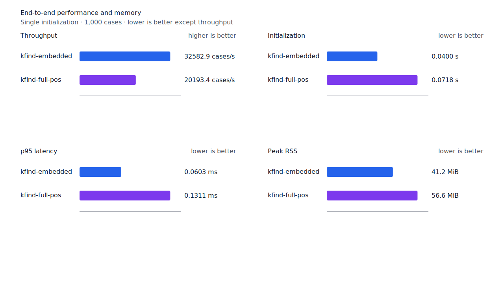
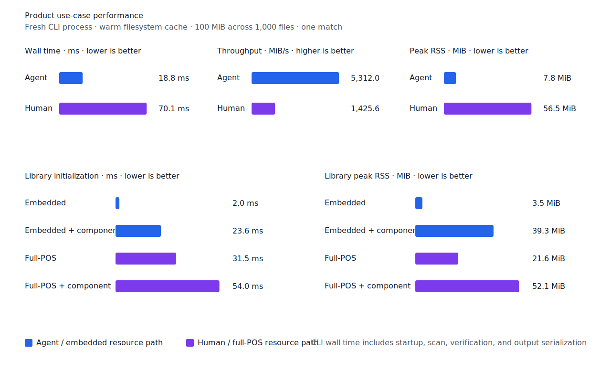

# 사전 voice 파생 활용 recall

- 측정일: 2026-07-18
- 기준 revision: `753c67103a967a673607475454380515625f90fe`
- 후보 코드 revision: `e7da2937d4db3037fd97e13723f8448281625252`
- 환경: Linux 6.12.76/linuxkit aarch64, 10 logical CPUs, Python 3.12.13,
  Rust 1.97.0, Docker 29.6.1
- 반복: fresh process warm-up 1회 뒤 5회 측정의 중앙값과 min/max
- canonical fixture:
  `1497b958a6970c55bc68ff148e435a88366b650c971231c3ae40adb9d8c46572`
- explicit-POS matrix:
  `e862d8af010c23462ba3a9ebf4f1134275b68de5004bc60035565734f5f19999`
- contract review registry:
  `3aa7f3be5dc4a9f0c44a18c0bde4a570b790c9372271cd15eb05e149d3a3e50e`
- 기준 report SHA-256:
  `6b46b5f9335ebe7e96baffc5d8f55d77ce15159e5993fd7780425766b58f37a7`
- 후보 report SHA-256:
  `7b95989126d64462e13692b040d23f337329d5b16e894df6f89d972c5432978c`

## 결론

`밀다→밀려`를 회수해 test query matrix full-POS raw FN을 8→7, FNᶜ를 4→3으로
줄였다. Raw FP 4와 FPᶜ 0은 유지했고 recallᶜ는 99.69%→99.77%다. Canonical
full-POS와 Robust explicit-POS도 각각 FN 한 건을 줄였으며 신규 FP는 없다.

표면 alias나 모든 동사에 적용하는 접미사 규칙은 추가하지 않았다. 한국어기초사전의 직접
`파생어` 관계와 표준국어대사전의 양쪽 일반어 동사 등재가 함께 확인된 voice lemma 관계만
저장하고 target lemma의 일반 활용기를 재사용한다. `smart`는 생성된 target 활용 표면 전체가
완성된 용언+어미 구조와 일치할 때만 승인한다.

## 사전 관계와 배포 검증

Importer는 한국어기초사전 source 동사가 target 동사를 직접 가리키고 target이 source 어간에
`이·히·리·기 + 다`를 붙인 형태일 때 후보를 만든다. 표준국어대사전에서 source와 target이
모두 일반어 동사인지 다시 확인한다. 구조화된 표제어·품사·관계만 사용하며 정의와 예문은
읽지 않는다. 관계 필드가 피동과 사동 의미 역할을 구분하지 않으므로 runtime 명칭은
`dictionary-voice`다.

`밀다→밀리다`의 한국어기초사전 관계는 `74177→91205`다. 표준국어대사전에도 양쪽 동사가
있으며 우리말샘은 audit에만 사용했다. 배포 행은 다음과 같다.

```text
밀다\tVV\tSurfaceOnly\t\t\tlexical.dictionary-voice=밀리다
```

| 항목 | 기준 | 후보 | 변화 |
| --- | ---: | ---: | ---: |
| 사전 voice 관계 | 0 | 225 | +225 |
| `SurfaceOnly` 행 | 295 | 520 | +225 |
| enriched TSV | 28,286 bytes | 42,910 bytes | +14,624 bytes (+51.70%) |

64 KiB 상한까지 22,626바이트가 남는다. 이 수치는 임의의 배포 guard이므로 행 수를 hard limit으로
쓰지 않는다. 생성기는 한도와 무관하게 재사용 가능한 candidate·report·통계를 한 번 만들고
보존한다. 별도 validator가 UTF-8, 6열 schema, 통계 일치와 64 KiB를 검사한다. 이번 증가는
full-POS startup을 늦추지 않았고 100 MiB CLI 처리량도 유지돼 byte 상한은 변경하지 않았다.

| source | snapshot SHA-256 |
| --- | --- |
| 한국어기초사전 2026-06-19 | `a8ab7d044d4f6341e0f217db63f38f4d18beed3e1f153130f6cb4e9494fea1d6` |
| 표준국어대사전 2026-07-05 | `880b31447146df5879c076012b21d4cc3c0c24e70fd91be7fc73f7ff7da34d52` |
| 우리말샘 2026-07-02 | `9e8807e5fade8c7b59431d1ab527fe93aafd15395001bcdde88511e8c9293b42` |

## 품질

| fixture/profile | 기준 TP / FP / TN / FN | 후보 TP / FP / TN / FN | precision | recall |
| --- | ---: | ---: | ---: | ---: |
| canonical full-POS smart | 496 / 2 / 498 / 4 | 497 / 2 / 498 / 3 | 99.60% → 99.60% | 99.20% → 99.40% |
| development full-POS smart | 485 / 2 / 498 / 15 | 485 / 2 / 498 / 15 | 99.59% → 99.59% | 97.00% → 97.00% |
| test matrix full-POS smart | 1,288 / 4 / 1,292 / 8 | 1,289 / 4 / 1,292 / 7 | 99.69% → 99.69% | 99.38% → 99.46% |
| hard-negative full-POS smart | 0 / 6 / 33 / 0 | 0 / 6 / 33 / 0 | n/a (hard-negative 84.62% → 84.62%) | n/a |
| Robust explicit-POS full-POS | 203 / 1 / 249 / 47 | 204 / 1 / 249 / 46 | 99.51% → 99.51% | 81.20% → 81.60% |

Test matrix contract 값은 `TPᶜ/FPᶜ/TNᶜ/FNᶜ 1,292/0/1,293/4`에서
`1,293/0/1,293/3`으로 바뀌었다. 잔여 raw FN 7건은 disposition ledger와 대조해
`product-fix 1`, `structural-redesign 2`, `gold-alignment-error 1`,
`nonstandard-input 3`, 미분류 0건을 확인했다.

Canonical과 matrix에서 query `밀다`는 문장 `즉 정부가 … 강대국의 압력에 밀려 시장개방을 …`의
byte `100..106`인 `밀려`를 정확히 반환한다. Robust에서 query `보다`는
`어느 어린이 … 먹어 보이고 정말 행복 …`의 byte `66..75`인 `보이고`를
`lexical.dictionary-voice`, `ending.connective-go` 경로로 회수한다.





## 성능

공식 case-loop는 각 case마다 query compile과 matcher 생성을 포함한다. Candidate는 같은 사전
관계 객체의 target branch와 fallback stem을 지연 생성해 clone 간 재사용하지만, voice source
query의 target 활용 program이 늘어 match 준비·실행 비용은 남는다.

| workload/지표 | 기준 median [min, max] | 후보 median [min, max] | 변화 |
| --- | ---: | ---: | ---: |
| canonical full-POS initialization | 0.070992 s [0.070713, 0.073311] | 0.071793 s [0.071075, 0.072928] | +1.13% |
| canonical full-POS cases/s | 21,953.2 [20,637.4, 22,086.1] | 20,193.4 [19,847.3, 20,697.1] | -8.02% |
| canonical full-POS p95 | 0.1124 ms [0.1087, 0.1174] | 0.1311 ms [0.1281, 0.1353] | +16.64% |
| canonical full-POS RSS | 58,976 KiB [58,776, 59,340] | 57,924 KiB [57,888, 58,896] | -1.78% |
| matrix full-POS cases/s | 21,699.1 [20,259.0, 22,132.3] | 20,759.1 [20,417.4, 20,972.6] | -4.33% |
| matrix full-POS p95 | 0.1106 ms [0.1086, 0.1194] | 0.1296 ms [0.1270, 0.1303] | +17.18% |
| matrix Human cases/s | 19,584.8 [18,537.2, 20,018.1] | 18,976.1 [17,206.7, 19,000.9] | -3.11% |
| matrix Human p95 | 0.1297 ms [0.1250, 0.1341] | 0.1405 ms [0.1399, 0.1533] | +8.33% |
| Robust explicit-POS cases/s | 21,741.2 [21,597.9, 22,161.0] | 19,999.6 [19,565.1, 20,183.3] | -8.01% |
| Robust explicit-POS p95 | 0.1111 ms [0.1087, 0.1125] | 0.1320 ms [0.1298, 0.1329] | +18.81% |

문법 관계나 `smart` 구조 검증을 줄이면 표면 alias와 같은 과승격이 되므로 유지한다. 실제 검색은
query를 한 번 compile해 여러 파일을 순회한다. 같은 100 MiB Human CLI는 wall
`0.071351→0.070144s`(-1.69%), throughput `1,401.53→1,425.63 MiB/s`(+1.72%), RSS
`57,664→57,816 KiB`(+0.26%)다. Resource-only full-POS startup은
`0.032782→0.031532s`(-3.81%)이고 RSS 중앙값은 `20,808→22,092 KiB`(+6.17%)다.





## 재현

```console
git switch --detach 753c67103a967a673607475454380515625f90fe
KFIND_MORPH_RUNS=5 scripts/benchmark-morphology.sh target/pr4-baseline-report

git switch --detach e7da2937d4db3037fd97e13723f8448281625252
KFIND_NIKL_DOWNLOADS=/path/to/nikl-downloads \
KFIND_NIKL_CACHE=target/nikl-cache \
scripts/build-enriched-predicates.sh
python3 tools/nikl-lexicon/validate_enriched.py data/enriched
KFIND_MORPH_RUNS=5 scripts/benchmark-morphology.sh \
  target/pr4-candidate-cached-rerun-report

python3 tools/morph-compare/validate_fnc_dispositions.py \
  target/pr4-candidate-cached-rerun-report/report.json \
  docs/benchmarks/query-matrix-fnc-dispositions.tsv

python3 tools/morph-compare/render_charts.py \
  target/pr4-candidate-cached-rerun-report/report.json \
  docs/benchmarks/assets \
  --prefix 2026-07-18-dictionary-voice-derivation-
```
