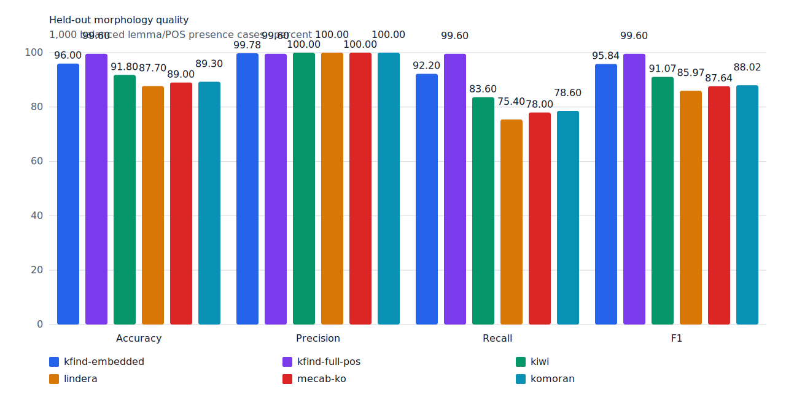
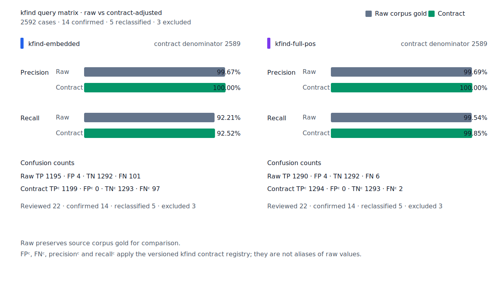
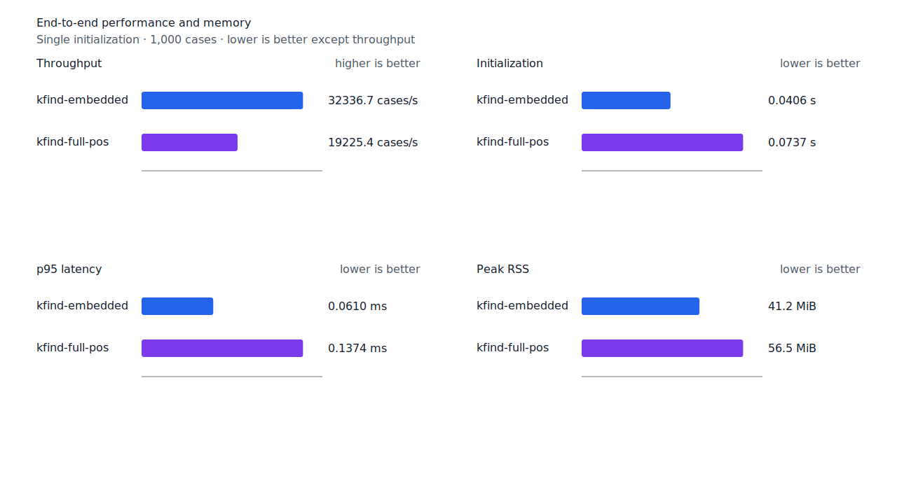
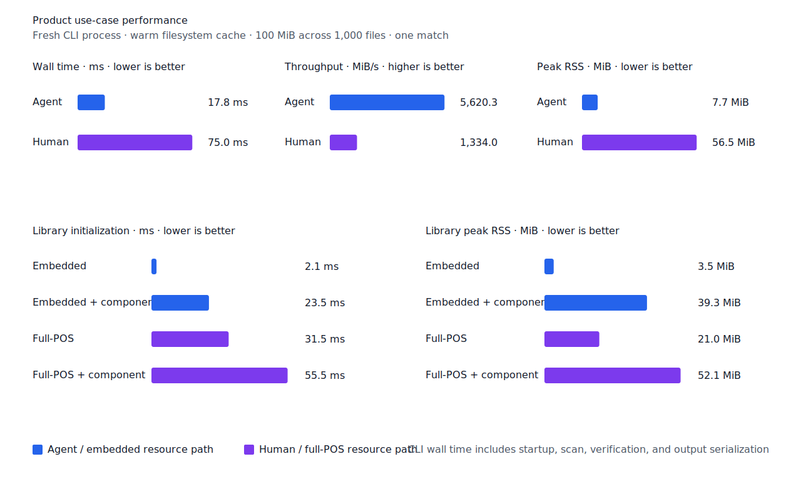

# 파생 용언 앞 명사 파생 경로 recall

- 측정일: 2026-07-18
- 기준 revision: `69a1ccc9bc814afc8015dfb8380e39333db9c98b`
- 후보 코드 revision: `93811e511c73acad3b0e74409dd2b1dd5b2181cb`
- 환경: Linux 6.12.76/linuxkit aarch64, 10 logical CPUs, Python 3.12.13,
  Rust 1.97.0, Docker 29.6.1
- 반복: fresh process warm-up 1회 뒤 5회 측정의 중앙값과 min/max
- canonical fixture:
  `1497b958a6970c55bc68ff148e435a88366b650c971231c3ae40adb9d8c46572`
- explicit-POS matrix:
  `e862d8af010c23462ba3a9ebf4f1134275b68de5004bc60035565734f5f19999`
- contract review registry:
  `3aa7f3be5dc4a9f0c44a18c0bde4a570b790c9372271cd15eb05e149d3a3e50e`
- 기준 report SHA-256:
  `300b508b47c421c90a398221da0d300405ce59b8938ec54130379e2498a3`
- 후보 report SHA-256:
  `34d533f3ce254c99ee97f0687531a0087d50e3a28838e1180d22ad18c4337fde`

## 결론

`잠식당→잠식당하기`를 회수해 test query matrix full-POS raw FN을 7→6,
FNᶜ를 3→2로 줄였다. Raw FP 4와 FPᶜ 0은 유지했고 recallᶜ는
99.77%→99.85%다. Canonical embedded·full-POS와 무품사 Human도 각각 FN 한 건을
줄였으며 신규 FP는 없다.

`smart`는 token 왼쪽 경계부터 `N+ + XSN+`로 끝나는 query core와 그 직후부터
token 끝까지 이어지는 `XSV/XSA + E+`를 함께 요구한다. 특정 표면형이나 사전 alias를
추가하지 않았고, query가 `NominalParticles` runtime component 계약을 가질 때만 이 DFA를
계산한다.

## 구조 판정

목표 문장의 gold는 byte `175..190`인 `잠식당하기`다. Query core는 byte
`175..184`의 `잠식당`이며 source에는 다음 두 경로가 경쟁한다.

```text
잠식/NNG + 당하/XSV + 기/ETN
잠식/NNG + 당/XSN + 하/XSV + 기/ETN
```

기준선은 두 경로 모두 query component를 포함하지 않는다고 판정했다. 후보는 두 번째 경로의
`NNG + XSN` prefix와 `XSV + ETN` suffix를 독립적으로 완결해 명사 core를 유지한다. Token
내부 `식당`, `XSN` 경계를 가로지르는 core, 파생 용언 뒤 어미가 없는 `잠식당하`와 기존
`NNG + NNG + XSV` 분할은 계속 거부한다.

## 품질

| fixture/profile | 기준 TP / FP / TN / FN | 후보 TP / FP / TN / FN | precision | recall |
| --- | ---: | ---: | ---: | ---: |
| canonical embedded smart | 460 / 1 / 499 / 40 | 461 / 1 / 499 / 39 | 99.78% → 99.78% | 92.00% → 92.20% |
| canonical full-POS smart | 497 / 2 / 498 / 3 | 498 / 2 / 498 / 2 | 99.60% → 99.60% | 99.40% → 99.60% |
| development full-POS smart | 485 / 2 / 498 / 15 | 485 / 2 / 498 / 15 | 99.59% → 99.59% | 97.00% → 97.00% |
| test matrix embedded smart | 1,194 / 4 / 1,292 / 102 | 1,195 / 4 / 1,292 / 101 | 99.67% → 99.67% | 92.13% → 92.21% |
| test matrix full-POS smart | 1,289 / 4 / 1,292 / 7 | 1,290 / 4 / 1,292 / 6 | 99.69% → 99.69% | 99.46% → 99.54% |
| test matrix Human smart | 1,283 / 6 / 1,290 / 13 | 1,284 / 6 / 1,290 / 12 | 99.53% → 99.53% | 99.00% → 99.07% |
| hard-negative full-POS smart | 0 / 6 / 33 / 0 | 0 / 6 / 33 / 0 | n/a (hard-negative 84.62% → 84.62%) | n/a |
| Robust explicit-POS full-POS | 204 / 1 / 249 / 46 | 204 / 1 / 249 / 46 | 99.51% → 99.51% | 81.60% → 81.60% |

Test matrix contract 값은 `TPᶜ/FPᶜ/TNᶜ/FNᶜ 1,293/0/1,293/3`에서
`1,294/0/1,293/2`로 바뀌었다. 잔여 raw FN 6건은 disposition ledger와 대조해
`structural-redesign 2`, `gold-alignment-error 1`, `nonstandard-input 3`, 미분류 0건을
확인했다. Canonical과 matrix에서 제거된 FN은 각각
`pos:ud-korean-kaist:MH2_0190-s434:17:0`과
`matrix:pos:ud-korean-kaist:MH2_0190-s434:1`뿐이다.





## 성능

구조를 표면 alias로 축소하지 않고 완성된 source node 전이를 검증한다. DFA는 관련 명사
query에서만 계산하지만 해당 case-loop에는 추가 비용이 남는다.

| workload/지표 | 기준 median [min, max] | 후보 median [min, max] | 변화 |
| --- | ---: | ---: | ---: |
| canonical full-POS initialization | 0.071426 s [0.071079, 0.072847] | 0.073693 s [0.072523, 0.076312] | +3.17% |
| canonical full-POS cases/s | 20,200.4 [19,712.2, 20,615.7] | 19,225.4 [18,400.1, 20,321.1] | -4.83% |
| canonical full-POS p95 | 0.1314 ms [0.1305, 0.1342] | 0.1374 ms [0.1283, 0.1467] | +4.57% |
| canonical full-POS RSS | 57,912 KiB [57,900, 59,056] | 57,852 KiB [57,844, 57,920] | -0.10% |
| matrix full-POS cases/s | 20,527.0 [20,102.2, 20,919.7] | 20,224.8 [18,808.1, 20,652.4] | -1.47% |
| matrix full-POS p95 | 0.1280 ms [0.1270, 0.1318] | 0.1302 ms [0.1269, 0.1384] | +1.72% |
| matrix Human cases/s | 18,651.6 [17,731.1, 19,023.7] | 17,802.3 [17,668.1, 17,881.2] | -4.55% |
| matrix Human p95 | 0.1414 ms [0.1391, 0.1502] | 0.1461 ms [0.1440, 0.1481] | +3.32% |
| Robust explicit-POS cases/s | 19,945.2 [19,660.9, 20,019.2] | 19,750.6 [18,762.1, 19,926.5] | -0.98% |
| Robust explicit-POS p95 | 0.1351 ms [0.1328, 0.1404] | 0.1312 ms [0.1288, 0.1365] | -2.89% |

실제 100 MiB CLI의 Agent 처리량은 `5,418.13→5,620.28 MiB/s`(+3.73%)다. Human
처리량은 `1,410.08→1,333.98 MiB/s`(-5.40%), wall은 `0.070918→0.074964s`
(+5.71%)다. Full-POS+component startup은 `0.056352→0.055548s`(-1.43%)이고 RSS는
53,392 KiB로 같다. 품질 이득과 source 구조 보존을 우선해 이 비용을 수용하며 이후 공통
edge 전이 계산 최적화에서 회수한다.





## 재현

```console
git switch --detach 69a1ccc9bc814afc8015dfb8380e39333db9c98b
KFIND_MORPH_RUNS=5 scripts/benchmark-morphology.sh target/pr5-baseline-report

git switch --detach 93811e511c73acad3b0e74409dd2b1dd5b2181cb
KFIND_MORPH_RUNS=5 scripts/benchmark-morphology.sh target/pr5-candidate-final-report

python3 tools/morph-compare/validate_fnc_dispositions.py \
  target/pr5-candidate-final-report/report.json \
  docs/benchmarks/query-matrix-fnc-dispositions.tsv

python3 tools/morph-compare/render_charts.py \
  target/pr5-candidate-final-report/report.json \
  docs/benchmarks/assets \
  --prefix 2026-07-18-nominal-derivational-predicate-
```
