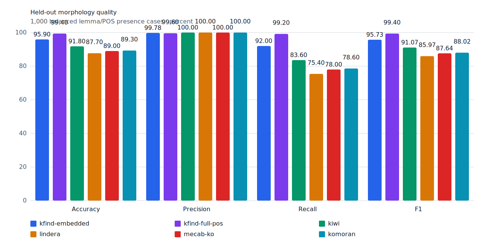
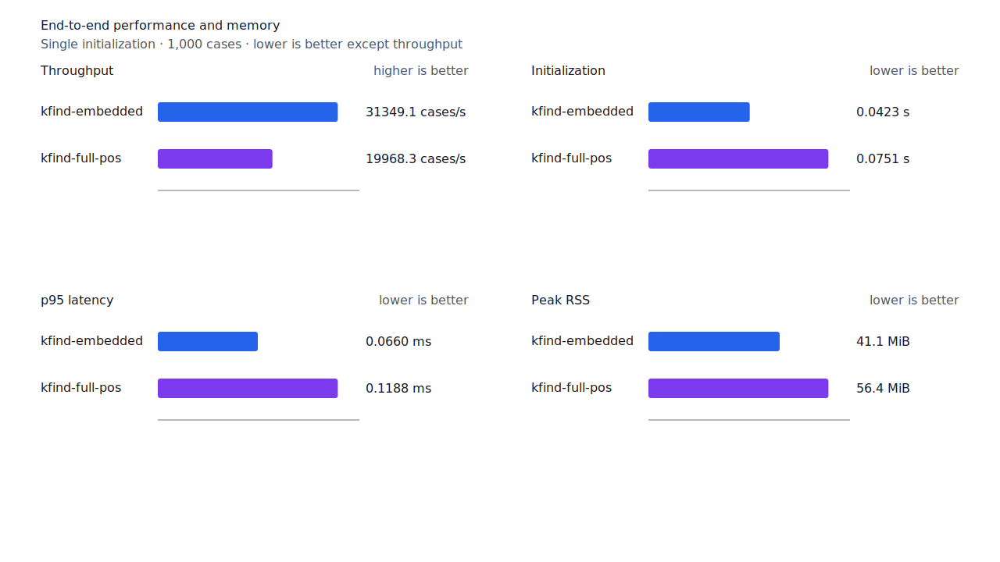

# 대명사 계사·의문 어미 축약 recall

- 측정일: 2026-07-18
- 기준 revision: `67b5606f34a756f104e4bb443ada30d936758b13`
- 후보 revision: `a240de536661f9c7bbf9169062338ca055bad491`
- 환경: Linux 6.12.76/linuxkit aarch64, 10 logical CPUs, Python 3.12.13,
  Rust 1.97.0, Docker 29.6.1
- 반복: fresh process warm-up 1회 뒤 5회 측정의 중앙값과 min/max
- canonical fixture:
  `1497b958a6970c55bc68ff148e435a88366b650c971231c3ae40adb9d8c46572`
- explicit-POS matrix:
  `e862d8af010c23462ba3a9ebf4f1134275b68de5004bc60035565734f5f19999`
- contract review registry:
  `3aa7f3be5dc4a9f0c44a18c0bde4a570b790c9372271cd15eb05e149d3a3e50e`
- development fixture:
  `4fc633de3a5978e664418899863e54d5116f8843dd33b2f66f5b5a0fae6ed098`
- hard-negative fixture:
  `99d132aae90e708b8e92e2b29a20e61603155f7485009cf175c6e9ccfa180296`
- 기준 report SHA-256:
  `c71479ec3ede16610a6433714df9a6dbd8d39f8437a0c1bd0756a022e1f91337`
- 후보 report SHA-256:
  `7c9105668ba2e6b40d8f1e05fa7efc5461e2a3c3f269d60273b2e060942a2a32`

## 결론

`무어→무언가`, `누구→누군가가`를 회수해 query matrix full-POS raw FN을 13→11,
FNᶜ를 9→7로 줄였다. FP 4와 FPᶜ 0은 유지했고 recallᶜ는 99.31%→99.46%다.
Canonical embedded와 full-POS도 같은 두 건을 회수했으며 development와 hard-negative 예측은
변하지 않았다.

별도 표제어를 alias로 합치지 않았다. 규칙은 query 대명사와 축약 표면을 대응시키고,
`smart`는 축약 표면 전체에 `NP + VCP + E+` source 분석이 있으며 `EC` 또는 `EF`로 끝날
때만 승인한다. 뒤의 조사는 기존 체언 조사 전이 graph로 token 끝까지 소비한다.

## 사전과 형태소 원천

국립국어원 exact audit에서 `누구`, `무어`, `무엇`은 대명사로 확인했다. 그러나 `누군가`와
`무언가`는 기본 두 사전에서 원 표제어와의 구조화 관계 합의가 없거나 별도 명사이므로 사전
alias 근거로 사용하지 않았다. Audit JSON SHA-256은
`51c4b409644fc3274f21fb8ac9f7b11de27eda9a840851ab4b822b9394fa1ba9`다.

고정 `mecab-ko-dic-2.1.1-20180720` 원천은 다음 whole 분석을 선언한다.

```text
누군가 = 누구/NP + 이/VCP + ᆫ가/EC|EF
무언가 = 무어|무엇/NP + 이/VCP + ㄴ가|ᆫ가/EC|EF
```

융합 표면은 component byte span을 안정적으로 정렬할 수 없으므로 whole 품사열을 검증한다.
`무엇`은 국립국어원 대명사 품사와 같은 source 분석이 모두 확인돼 같은 bounded 규칙에 포함했다.
`어디`, `언제` 등 이번 query·source 대조 범위를 넘는 어휘는 확장하지 않았다.

| source | snapshot SHA-256 |
| --- | --- |
| 한국어기초사전 2026-06-19 | `a8ab7d044d4f6341e0f217db63f38f4d18beed3e1f153130f6cb4e9494fea1d6` |
| 표준국어대사전 2026-07-05 | `880b31447146df5879c076012b21d4cc3c0c24e70fd91be7fc73f7ff7da34d52` |
| 우리말샘 2026-07-02 | `9e8807e5fade8c7b59431d1ab527fe93aafd15395001bcdde88511e8c9293b42` |
| mecab-ko-dic archive | `fd62d3d6d8fa85145528065fabad4d7cb20f6b2201e71be4081a4e9701a5b330` |

## 품질

| fixture/profile | 기준 TP / FP / TN / FN | 후보 TP / FP / TN / FN | precision | recall |
| --- | ---: | ---: | ---: | ---: |
| canonical embedded smart | 458 / 1 / 499 / 42 | 460 / 1 / 499 / 40 | 99.78% → 99.78% | 91.60% → 92.00% |
| canonical full-POS smart | 494 / 2 / 498 / 6 | 496 / 2 / 498 / 4 | 99.60% → 99.60% | 98.80% → 99.20% |
| test matrix embedded smart | 1,192 / 4 / 1,292 / 104 | 1,194 / 4 / 1,292 / 102 | 99.67% → 99.67% | 91.98% → 92.13% |
| test matrix full-POS smart | 1,283 / 4 / 1,292 / 13 | 1,285 / 4 / 1,292 / 11 | 99.69% → 99.69% | 99.00% → 99.15% |
| development full-POS smart | 485 / 3 / 497 / 15 | 485 / 3 / 497 / 15 | 99.39% → 99.39% | 97.00% → 97.00% |

Test matrix contract 값은 embedded가 `TPᶜ/FPᶜ/TNᶜ/FNᶜ 1,196/0/1,293/100`에서
`1,198/0/1,293/98`, full-POS가 `1,287/0/1,293/9`에서 `1,289/0/1,293/7`로
바뀌었다. Full-POS에서 모든 present query를 회수한 문장은 423→425/432다. 기존
hard-negative는 `FP 6 / TN 33`으로 동일하다.

잔여 raw FN 11건은 처분 장부와 대조해 `product-fix 5`, `structural-redesign 2`,
`gold-alignment-error 1`, `nonstandard-input 3`, 미분류 0건을 확인했다.



## 성능

Canonical full-POS `smart`의 같은 1,000 case를 비교했다.

| 지표 | 기준 median [min, max] | 후보 median [min, max] | 변화 |
| --- | ---: | ---: | ---: |
| initialization | 0.073030 s [0.072759, 0.076746] | 0.075141 s [0.074391, 0.077134] | +2.89% |
| cases/s | 20,916.2 [20,178.0, 21,067.1] | 19,968.3 [19,309.6, 20,526.2] | -4.53% |
| p95 | 0.1166 ms [0.1138, 0.1192] | 0.1188 ms [0.1175, 0.1235] | +1.89% |
| peak RSS | 58,820 KiB [58,684, 59,452] | 57,772 KiB [57,732, 57,844] | -1.78% |

초기화·처리량·p95 변화는 측정 범위가 겹치고 성능 gate 안이며 RSS는 감소했다. 구조 검증을
경계 판정으로 낮추거나 임의 배포 상한을 도입할 근거가 없어 source whole 품사열 검증을 유지한다.



## 재현

```console
python3 tools/nikl-lexicon/audit_lexemes.py \
  --krdict /path/to/krdict.zip \
  --stdict /path/to/stdict.zip \
  --opendict /path/to/opendict.zip \
  --cache-dir target/nikl-cache \
  --query 누구 --query 누군가 --query 무어 --query 무엇 --query 무언가 \
  --output target/fnc-pronoun-nikl-lexemes.json

git switch --detach 67b5606f34a756f104e4bb443ada30d936758b13
KFIND_MORPH_RUNS=5 scripts/benchmark-morphology.sh target/fnc-pronoun-rebased-baseline

git switch --detach a240de536661f9c7bbf9169062338ca055bad491
KFIND_MORPH_RUNS=5 scripts/benchmark-morphology.sh target/fnc-pronoun-rebased-candidate

python3 tools/morph-compare/validate_fnc_dispositions.py \
  target/fnc-pronoun-rebased-candidate/report.json \
  docs/benchmarks/query-matrix-fnc-dispositions.tsv
```
