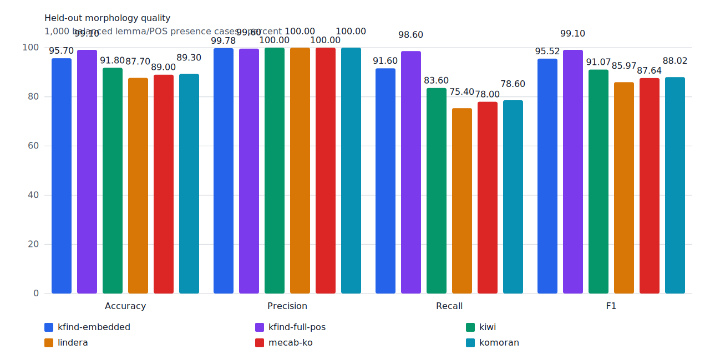
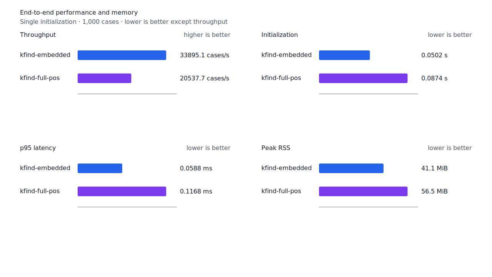

# Query matrix 문법 구조와 잔여 FN 처분

- 측정일: 2026-07-18
- 최신 `origin/main` 및 기준 revision:
  `05852ea248f8d19612e366b0eef2518c54a2435e`
- 후보 revision: `1510302fee5bde7b41a5305020abf24d45fc2a19`
- 환경: Linux 6.12.76/linuxkit aarch64, 10 logical CPUs, Python 3.12.13,
  Rust 1.97.0, Docker 29.6.1
- 반복: fresh process warm-up 1회 뒤 5회 측정의 중앙값
- canonical fixture:
  `1497b958a6970c55bc68ff148e435a88366b650c971231c3ae40adb9d8c46572`
- explicit-POS matrix:
  `b4a7294e15b137407fffbaa90202ffeaf05598a01404b06a839931ca9563088b`
- development matrix:
  `0398c87744aa8136dc4bc80f9e042531a931d3f92fa177fc961bf8f77958413b`
- hard-negative fixture:
  `f4d8829977ebfd061003724ee4aeb23b36dd901f6e46171c924a1f52a63f0ee5`
- 기준 report SHA-256:
  `3c3cf2616a6fe6cad559a6ea61176d7544427b5beeaeacdc372d76735f13aa1c`
- 후보 report SHA-256:
  `6efea02627678f4e4c7391d00ceff573df1edb4eba546fd3870b62284e627793`

## 결론

특정 benchmark 표면형을 추가하지 않고 조사 host·전이, 체언 subpath, 지정사, 용언
continuation과 source 품사 증거를 하나의 구조로 정리했다. Test matrix full-POS는
`TP/FP/TN/FN 1,250/8/1,288/46`에서 `1,278/8/1,288/18`이 됐다. 이 수치는 corpus gold를
그대로 쓴 raw 값이다. 별도 처분 장부가 raw FN 18건을 모두 검증하므로 미분류 raw FN은 0건이다.

후속 계약 검토에서 이 보고서가 raw FP·FN을 FPᶜ·FNᶜ로 잘못 부른 점을 교정했다. 현재 계약값과
구현 목표 분류는 [raw·계약 품질 교정](2026-07-18-query-matrix-contract-metrics.md)을 따른다.

## 문법 구조

조사는 `data/rules/particles.toml`의 37개 규칙, 51개 원자 표면, 193개 방향 전이로
검증한다. Host는 체언 37개, 부사 8개, 용언 어미 9개 규칙에 선언돼 있다. `까지도`를
원자 표면으로 넣지 않고 `까지 → 도`로 처리하며 같은 전이에서 `까지만`, `까지는`,
`까지만은`도 함께 지원한다. 선언되지 않은 `도까지`, `까지도만`, `들로부터까지만`은
거부한다.

전체 rule vocabulary와 조사 graph는 analyzer에서 한 번 만들고 plan과 matcher가 `Arc`로
공유한다. 명시적 동사 질의는 본용언과 보조용언 분석을 모두 보존한다. 활용 실행이 같은
`VV/VX`는 한 program을 쓰되 source 품사 집합을 따로 유지하므로 고정 형태소 자원에서는
두 품사를 각각 검증한다. 8-atom 기준 program 수는 기준 91개, 후보 95개다.

회수한 matrix full-POS 28건은 다음 구조로 묶인다.

| 구조 | 건수 | 회수 표면 |
| --- | ---: | --- |
| 체언·부사 host와 조사 전이 | 10 | `후에도`, `실제로는`, `혹시나`, `내륙고원지대에서는`, `점유도는`, `선박회사측에서는`, `까보데오르노스는`, `중남미까지도`, `엔블록으로`, `금융기관으로부터의` |
| 복합명사 내부의 완성 체언 subpath | 1 | `경영전략시스템→경영전략` |
| 체언·조사 뒤 지정사와 축약 | 6 | `섬나라이므로`, `획기적인`, `상표다`, `본부다`, `구경거리였다`, `대학뿐이다` |
| 대명사+주제 조사 축약 | 1 | `그건→그거` |
| source가 증명한 보조용언 경로 | 4 | `되돌아갔다→가다`, `빨라져→지다`, `알려진→지다`, `뚜렷해졌다→지다` |
| 용언 어미·명사형 뒤 조사 | 5 | `아닐세`, `이름으로써`, `봄으로써`, `이기리라고는`, `크게는` |
| 경쟁 분석 속 정확한 관형사 | 1 | `전` |

`까지도` 하나를 위한 분기는 없으며 같은 조사 graph 테스트가 `까지도`, `까지만`,
`까지는`, `까지만은`, 격조사 뒤 보조사 계열과 잘못된 역전이를 함께 고정한다.

## 품질

다음 표는 당시 측정한 raw confusion matrix다.

| workload | 기준 TP / FP / TN / FN | 후보 TP / FP / TN / FN | precision | recall |
| --- | ---: | ---: | ---: | ---: |
| canonical full-POS | 485 / 2 / 498 / 15 | 493 / 2 / 498 / 7 | 99.59% → 99.60% | 97.00% → 98.60% |
| test matrix full-POS | 1,250 / 8 / 1,288 / 46 | 1,278 / 8 / 1,288 / 18 | 99.36% → 99.38% | 96.45% → 98.61% |
| development matrix full-POS | 1,192 / 2 / 1,264 / 74 | 1,220 / 4 / 1,262 / 46 | 99.83% → 99.67% | 94.15% → 96.37% |
| hard-negative full-POS | 0 / 6 / 32 / 0 | 0 / 6 / 32 / 0 | 동일 | 동일 |

Development의 신규 strict FP 두 건은 `이다→였다`와 `혹→혹은`이다. 전자는 문장 끝의
실제 지정사 활용이고 후자는 부사와 보조사 경로이므로 문법적으로는 회수해야 한다. Source가
두 형태를 negative로 만든 정렬 문제를 보고서에 그대로 남겼으며 점수를 재분류하지 않았다.
Test matrix와 hard-negative의 FP case는 늘지 않았다.



현재 full-POS contract는 raw `FP 4 / FN 18 / recall 98.61%`와 구분해
`FPᶜ 0 / FNᶜ 14 / recallᶜ 98.92%`로 기록한다.


## raw FN과 국립국어원 사전 근거

`query-matrix-fnc-dispositions.tsv`는 report의 fixture hash, backend, case ID, query, POS,
gold byte span과 자동 failure cause까지 다시 확인한다. 후보 report에서 검증한 처분은 다음과
같다.

| 처분 | 건수 | case |
| --- | ---: | --- |
| product-fix | 12 | 표준 부사·피동 파생, source 정렬 성분, 대명사 축약 |
| structural-redesign | 2 | `이다→걸까`, `하→책임하에서` |
| gold-alignment-error | 1 | `이→이중` |
| nonstandard-input | 3 | `국경없는`, `권위있는`, `빙원옆에` |

다운로드한 사전 원본은 활용 가능하다. Exact lexeme audit는 정의·예문을 복사하지 않고
표제어, 품사, 상태, source ID와 명시적 관계만 추출한다. 이번 장부는 다음 snapshot과
importer revision에 고정했다.

| source | snapshot SHA-256 |
| --- | --- |
| 한국어기초사전 2026-06-19 | `a8ab7d044d4f6341e0f217db63f38f4d18beed3e1f153130f6cb4e9494fea1d6` |
| 표준국어대사전 2026-07-05 | `880b31447146df5879c076012b21d4cc3c0c24e70fd91be7fc73f7ff7da34d52` |
| 우리말샘 2026-07-02 | `9e8807e5fade8c7b59431d1ab527fe93aafd15395001bcdde88511e8c9293b42` |
| importer | `48f384221a10b38bcfed4df38e262df9f35d964b` |

감사 결과 `올라가다`, `생겨나다`, `들어오다`, `밀리다`는 독립 동사 표제어다.
`누군가`·`무언가`는 기본 두 사전에서 원 표제어와의 구조화 관계 합의가 없고,
`책임하`, `국경없다`, `권위있다`, `빙원옆`, `걸까`는 exact 표제어가 아니다. 사전은
표제어·품사·관계 판단에는 쓸 수 있지만 소실된 byte span이나 source adapter 정렬을 만들 수
없다. 사전 합의가 없다는 이유만으로 표준 문법을 제품 목표에서 제외하지 않으며, 비표준 입력
3건과 gold 오류 1건을 뺀 14건은 FNᶜ로 유지한다.

## 성능

모든 행은 같은 image와 fixture에서 `median [min, max]`로 측정했다.

| workload | revision | initialization (s) | cases/s | p95 (ms) | RSS (KiB) |
| --- | --- | ---: | ---: | ---: | ---: |
| canonical embedded | 기준 | 0.045819 | 20,899.2 [20,431.4, 21,346.9] | 0.0703 [0.0698, 0.0728] | 41,920 [41,916, 41,932] |
| canonical embedded | 후보 | 0.050188 | 33,895.1 [30,055.9, 34,990.5] | 0.0588 [0.0582, 0.0676] | 42,116 [42,100, 42,124] |
| canonical full-POS | 기준 | 0.086987 | 15,890.8 [14,369.5, 16,241.1] | 0.1174 [0.1145, 0.1336] | 57,444 [57,436, 57,500] |
| canonical full-POS | 후보 | 0.087399 | 20,537.7 [20,424.3, 22,764.7] | 0.1168 [0.1073, 0.1190] | 57,820 [57,756, 57,844] |
| matrix embedded | 기준 | 0.045787 | 21,056.6 [19,904.6, 21,386.8] | 0.0705 [0.0696, 0.0754] | 44,600 [44,592, 44,604] |
| matrix embedded | 후보 | 0.045940 | 33,852.3 [30,252.8, 34,846.9] | 0.0600 [0.0583, 0.0689] | 44,884 [44,876, 44,888] |
| matrix full-POS | 기준 | 0.084611 | 16,393.2 [15,858.3, 16,676.7] | 0.1150 [0.1129, 0.1227] | 58,152 [58,152, 58,212] |
| matrix full-POS | 후보 | 0.088199 | 22,572.2 [20,254.0, 23,008.3] | 0.1055 [0.1020, 0.1171] | 58,472 [58,472, 58,536] |

후보의 canonical cases/s는 embedded +62.18%, full-POS +29.24%다. Matrix는 각각
+60.77%, +37.69%다. Query compile p95는 단일 atom 62.794→47.122µs(-24.96%),
8 atom 119.975→118.033µs(-1.62%)다. `matcher/build_and_find_short` p95는
14.054→11.906µs(-15.29%)다. Initialization과 RSS를 포함해 회귀 경고선에 걸리는 지표는
없다.



## 재현

```console
git switch --detach 05852ea248f8d19612e366b0eef2518c54a2435e
KFIND_MORPH_RUNS=5 \
scripts/benchmark-morphology.sh target/morph-matrix-fnc-zero-baseline

git switch --detach 1510302fee5bde7b41a5305020abf24d45fc2a19
KFIND_MORPH_RUNS=5 \
scripts/benchmark-morphology.sh target/morph-matrix-fnc-zero-candidate-final

python3 tools/morph-compare/validate_fnc_dispositions.py \
  target/morph-matrix-fnc-zero-candidate-final/report.json \
  docs/benchmarks/query-matrix-fnc-dispositions.tsv

scripts/benchmark-criterion.sh query_compile
scripts/benchmark-criterion.sh matcher/build_and_find_short
```

외부 분석기 snapshot은 fixture, adapter schema와 고정 버전·설정이 바뀌지 않아 갱신하지
않았다.
