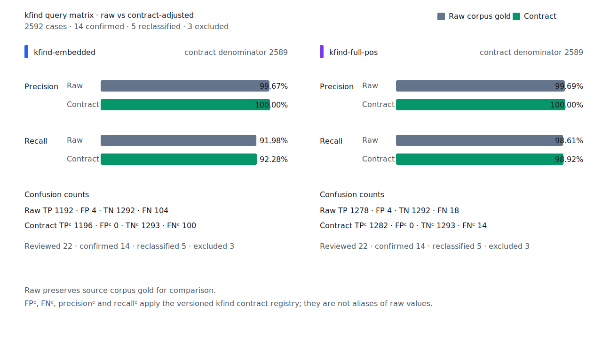

# Query matrix 잔여 raw FN·FP 구조 분석

- 측정일: 2026-07-18
- 최신 `origin/main` 및 기준 revision:
  `87dba100cedd85b713937729ef2236775938d536`
- 후보 revision: `0f4dee9748a998a4965a398b051233b73c1e52d2`
- 환경: Linux 6.12.76/linuxkit aarch64, 10 logical CPUs, Python 3.12.13,
  Rust 1.97.0, Docker 29.6.1
- 반복: fresh process warm-up 1회 뒤 5회 측정의 중앙값
- canonical fixture:
  `1497b958a6970c55bc68ff148e435a88366b650c971231c3ae40adb9d8c46572`
- explicit-POS matrix:
  `b4a7294e15b137407fffbaa90202ffeaf05598a01404b06a839931ca9563088b`
- development matrix:
  `0398c87744aa8136dc4bc80f9e042531a931d3f92fa177fc961bf8f77958413b`
- hard-negative fixture:
  `f4d8829977ebfd061003724ee4aeb23b36dd901f6e46171c924a1f52a63f0ee5`
- 기준 report SHA-256:
  `93884239542e8d21a28dcb8635566baa6d7205b6e2eb5dc5a3f44a8f76c7834f`
- 후보 report SHA-256:
  `8f3516f8159e798e80f83c69f034375bbef8ced1efdb0c3f36bbd6cb9fb1b0eb`

## 결론

표면형 예외나 품사별 결과 보정 없이 component graph의 구조 선택을 고쳤다. Test matrix
full-POS는 `TP/FP/TN/FN 1,278/8/1,288/18`에서 `1,278/4/1,292/18`이 됐다.
이 값은 contract annotation이 없던 당시의 raw confusion matrix다. Canonical, development,
hard-negative의 raw confusion matrix는 모두 유지됐다.

잔여 raw FN 18건은 기존 처분 장부와 다시 대조해 미분류 0건을 확인했다. 잔여 raw FP 4건은
동형어 의미 선택 또는 source 정렬 내부 성분이다. 후속 계약 검토에서는 이 4건을 계약 양성으로
분류하고, 비표준 입력 3건과 gold 정렬 오류 1건을 구분해 full-POS를
`FPᶜ 0 / FNᶜ 14 / recallᶜ 98.92%`로 교정했다.

현재 값과 14건의 구현 목표는
[raw·계약 품질 교정](2026-07-18-query-matrix-contract-metrics.md)을 따른다.

## 구조 원인과 수정

기존 resolver는 token을 덮는 임의 edge 경로를 runtime component 근거로 재사용했다. 이 때문에
query 품사 node가 없거나 다른 완성 분석이 더 강한 경우에도 내부 문자열이 독립 형태소가 됐다.
수정은 다음 네 구조에만 적용한다.

| 이동 | 기존 오인 | 구조 규칙 |
| --- | --- | --- |
| `남/pronoun`, `남아있는` | `남/NP` node 없이 다른 edge의 같은 span으로 대명사를 합성 | token보다 짧은 `NP` component는 같은 span의 `NP` node를 요구 |
| `그/determiner`, `그러했던` | 선두 `그/MM`만 보고 뒤의 용언 구조를 무시 | 내부 `MM`은 뒤쪽이 완전한 체언·선택적 조사 path일 때만 허용 |
| `한/noun`, `진출한`·`생산한` | `한/NNG`와 `XSV+ETM`을 독립 후보로 함께 유지 | 선행 체언과 `XSV/XSA + E* + ETM`, 다음 체언이 완성되면 파생 관형형을 선택 |
| `나다/verb`, `그러나` | `그/VV + 러/EC + 나/VX+EF` 겹침 경로를 보조용언으로 선택 | 완전한 `MAG/MAJ` whole 분석과 경쟁하는 내부 보조용언 path를 거부 |

Query 표면과 token 전체가 같은 독립 후보에는 내부 component 제한을 적용하지 않는다.
따라서 component resource에 `MM` whole node가 없는 `일정`, `리틀`도 full POS query 분석으로
계속 검색된다. `그때`의 exact 대명사 component와 실제 결합형 보조용언도 유지된다.

## 품질

| workload | profile | 기준 TP / FP / TN / FN | 후보 TP / FP / TN / FN |
| --- | --- | ---: | ---: |
| canonical | embedded | 458 / 1 / 499 / 42 | 458 / 1 / 499 / 42 |
| canonical | full-POS | 493 / 2 / 498 / 7 | 493 / 2 / 498 / 7 |
| test matrix | embedded | 1,192 / 7 / 1,289 / 104 | 1,192 / 4 / 1,292 / 104 |
| test matrix | full-POS | 1,278 / 8 / 1,288 / 18 | 1,278 / 4 / 1,292 / 18 |
| development matrix | embedded | 1,165 / 4 / 1,262 / 101 | 1,165 / 4 / 1,262 / 101 |
| development matrix | full-POS | 1,220 / 4 / 1,262 / 46 | 1,220 / 4 / 1,262 / 46 |
| hard-negative | full-POS | 0 / 6 / 32 / 0 | 0 / 6 / 32 / 0 |

Embedded는 앞의 세 component 오인을 제거했다. `나다`의 보조용언 분석은 full POS query에만
존재하므로 full-POS에서 네 번째 FP가 함께 제거됐다. TP나 FN으로 이동한 row는 없다.

## 잔여 raw FN

후보 report와 `query-matrix-fnc-dispositions.tsv`를 다시 검증한 결과는 다음과 같다.

| 처분 | 건수 |
| --- | ---: |
| product-fix | 12 |
| structural-redesign | 2 |
| gold-alignment-error | 1 |
| nonstandard-input | 3 |

Raw FN은 18건, 미분류 raw FN은 0건이다. 현재 contract에서는 표준 문법 14건을 FNᶜ로
유지하고 `이→이중`은 contract negative, 비표준 입력 3건은 제외한다.

## 잔여 raw FP와 사전 근거

| case | graph·문법 근거 | 국립국어원 사전 근거 | 결론 |
| --- | --- | --- | --- |
| `그/pronoun`, `그것이야말로` | `그/NP + 것/NNB + 조사`가 완성되고 whole `그것/NP`도 존재 | 기본 두 사전은 `그`, `그것`을 모두 대명사로 등재 | 같은 구조의 source component와 whole 대명사를 의미 없이 구분할 수 없음 |
| `불과/noun`, `불과 수미터` | query와 token이 같은 exact whole 후보 | 한국어기초사전은 부사, 표준국어대사전·우리말샘은 명사와 부사를 등재 | 사전 합의가 없고 exact 동형어라 구조 선택 불가 |
| `제/pronoun`, `제 규정` | whole `NP/MM`이 모두 있고 다음 token이 체언으로 시작 | 기본 두 사전은 대명사와 관형사를 모두 등재 | 같은 matrix가 `제 나라`의 대명사를 양성으로 두므로 source POS 정렬을 먼저 고쳐야 함 |
| `만/numeral`, `달 만에` | `만/NR`과 `만/NNB + 에/JKB`가 모두 완성 | 기본 두 사전은 수사·의존 명사·조사를 모두 등재 | 시간 의미나 source 정렬 없이 bounded 구조만으로 선택 불가 |

`수/수미터`와 `하순/하순경`의 source 수사 분석도 함께 감사했다. `수`는 기본 사전에
명사·의존 명사·관형사 등으로, `하순`은 세 사전에 명사로 등재돼 있고 수사 record는 없다.
이는 query matrix adapter의 coarse POS 정렬 문제다. 제품의 수사 호환 규칙을 좁히거나 고정
fixture를 바꾸지 않고 audit 대상으로 남겼다.

위 raw FP 4건은 모두 contract positive다. 문법 구조로 의미를 구분하지 않는다는 제품 계약을
적용하면 FPᶜ는 0이다.



사전 snapshot은 이전 raw FN 보고서와 같다.

| source | snapshot SHA-256 |
| --- | --- |
| 한국어기초사전 2026-06-19 | `a8ab7d044d4f6341e0f217db63f38f4d18beed3e1f153130f6cb4e9494fea1d6` |
| 표준국어대사전 2026-07-05 | `880b31447146df5879c076012b21d4cc3c0c24e70fd91be7fc73f7ff7da34d52` |
| 우리말샘 2026-07-02 | `9e8807e5fade8c7b59431d1ab527fe93aafd15395001bcdde88511e8c9293b42` |

## 성능

각 값은 `median [min, max]`다. 괄호는 기준 대비 중앙값 변화다.

| workload | profile | initialization (s) | cases/s | p95 (ms) | RSS (KiB) |
| --- | --- | ---: | ---: | ---: | ---: |
| canonical | embedded | 0.047936 [0.047009, 0.057150] → 0.048887 [0.048020, 0.050190] (+1.98%) | 34,391.7 [33,122.6, 34,723.4] → 33,399.3 [29,687.2, 33,761.2] (-2.89%) | 0.0599 [0.0594, 0.0608] → 0.0597 [0.0589, 0.0632] (-0.33%) | 42,116 [42,104, 42,124] → 42,120 [42,116, 42,124] (+0.01%) |
| canonical | full-POS | 0.088680 [0.087490, 0.093131] → 0.088227 [0.087072, 0.088920] (-0.51%) | 21,999.3 [20,593.6, 22,795.1] → 22,075.4 [21,540.8, 22,667.0] (+0.35%) | 0.1106 [0.1059, 0.1187] → 0.1099 [0.1067, 0.1125] (-0.63%) | 57,772 [57,704, 58,956] → 57,776 [57,712, 57,776] (+0.01%) |
| matrix | embedded | 0.048515 [0.047895, 0.050062] → 0.047659 [0.046554, 0.048008] (-1.76%) | 34,397.2 [29,031.4, 34,745.0] → 33,918.1 [33,254.9, 34,562.0] (-1.39%) | 0.0596 [0.0582, 0.0693] → 0.0597 [0.0590, 0.0607] (+0.17%) | 44,888 [44,880, 44,888] → 44,888 [44,884, 44,892] (0.00%) |
| matrix | full-POS | 0.089262 [0.087999, 0.089363] → 0.085880 [0.085669, 0.090170] (-3.79%) | 22,779.0 [22,035.7, 22,823.5] → 22,952.8 [20,172.6, 23,026.7] (+0.76%) | 0.1045 [0.1032, 0.1063] → 0.1023 [0.1015, 0.1160] (-2.11%) | 58,440 [58,416, 58,476] → 58,460 [58,400, 60,312] (+0.03%) |

10% 회귀 경고선에 걸리는 지표는 없다.

## 재현

```console
git switch --detach 87dba100cedd85b713937729ef2236775938d536
KFIND_MORPH_RUNS=5 \
scripts/benchmark-morphology.sh target/morph-residual-structure-baseline

git switch --detach 0f4dee9748a998a4965a398b051233b73c1e52d2
KFIND_MORPH_RUNS=5 \
scripts/benchmark-morphology.sh target/morph-residual-structure-candidate

python3 tools/morph-compare/validate_fnc_dispositions.py \
  target/morph-residual-structure-candidate/report.json \
  docs/benchmarks/query-matrix-fnc-dispositions.tsv

python3 tools/nikl-lexicon/audit_lexemes.py \
  --krdict /path/to/krdict.zip \
  --stdict /path/to/stdict.zip \
  --opendict /path/to/opendict.zip \
  --cache-dir target/nikl-cache \
  --query 그 --query 그것 --query 그러나 --query 그러하다 \
  --query 나다 --query 남 --query 만 --query 불과 --query 수 \
  --query 제 --query 하순 --query 한 \
  --output target/morph-residual-structure-candidate/nikl-lexemes.json
```
