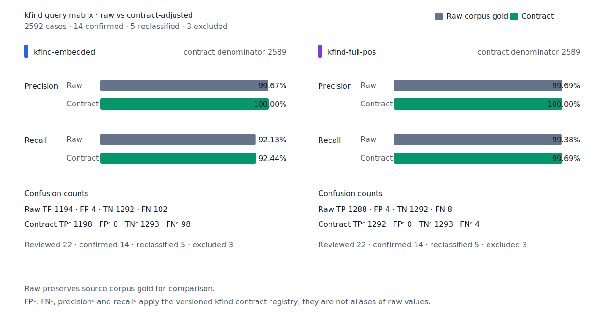
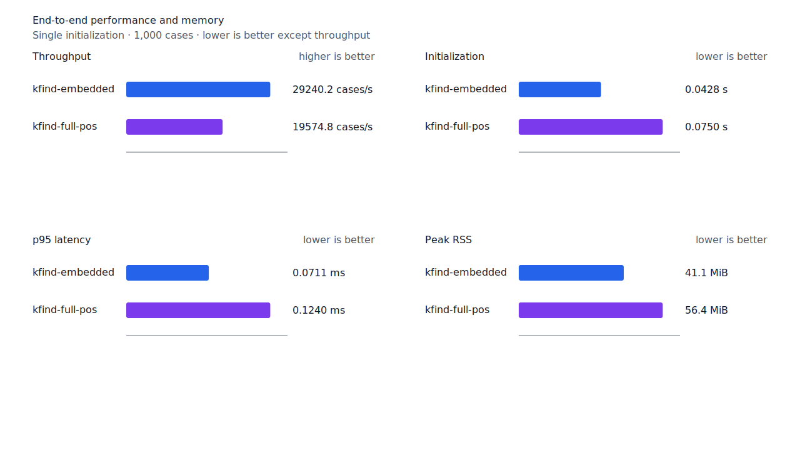

# source 정렬 합성용언 tail recall

- 측정일: 2026-07-18
- 기준 revision: `7ffc941e8c5cf79ecad34a421fc7b03a8b79fd3b`
- 후보 코드 revision: `d045ce0e70f5689210112198592e3a4c6ca69cda`
- 환경: Linux 6.12.76/linuxkit aarch64, 10 logical CPUs, Python 3.12.13,
  Rust 1.97.0, Docker 29.6.1
- 반복: fresh process warm-up 1회 뒤 5회 측정의 중앙값과 min/max
- canonical fixture:
  `1497b958a6970c55bc68ff148e435a88366b650c971231c3ae40adb9d8c46572`
- explicit-POS matrix:
  `e862d8af010c23462ba3a9ebf4f1134275b68de5004bc60035565734f5f19999`
- contract review registry:
  `3aa7f3be5dc4a9f0c44a18c0bde4a570b790c9372271cd15eb05e149d3a3e50e`
- 기준 report SHA-256:
  `64f919596192942adb6e1670a426768a2994203d70cc8f2d303b8c4510810220`
- 후보 report SHA-256:
  `f95a6099510020e1bea5663054d579faa1cb7b180b881ad581bd8b59065941ce`

## 결론

`가다→올라가`, `나다→생겨나`, `오다→들어와서는`을 회수해 test query matrix
full-POS raw FN을 11→8, FNᶜ를 7→4로 줄였다. Raw FP 4와 FPᶜ 0은 유지했고
recallᶜ는 99.46%→99.69%다. Canonical과 embedded matrix는 변하지 않았으며,
development full-POS의 기존 FP 한 건을 함께 제거했다.

어휘 alias나 부분 문자열 예외를 추가하지 않았다. `smart`는 token 왼쪽부터
`용언 + EP* + EC + 용언 + E* + J*`가 끝까지 이어지고 두 번째 용언의 span·세부 품사가
query core와 정확히 일치할 때만 tail을 유지한다. Whole 관형사·부사 분석은 runtime 분할보다
우선한다.

## source 구조와 음성 경로

국립국어원 exact audit에서 `올라가다`, `생겨나다`, `들어오다`는 독립 동사 표제어이며
원 query와의 구조화 관계 합의가 없다. 따라서 사전 표제어를 확장하지 않고 고정
`mecab-ko-dic-2.1.1-20180720` component graph만 구조 근거로 사용했다.

```text
올라/VV+EC + 가/VV
생겨/VV+EC + 나/VV
들어/VV+EC + 와/VV+EC + 는/JX
```

초기 후보는 `친구가`를 `친/VV+ETM + 구/EC + 가/VV`로 잘못 조합했다. `ETM`은 종결된
관형형이므로 뒤에 `EC`를 이어 붙일 수 없다. Connective DFA를 `EP* + EC`로 좁혀
`친구/NNG + 가/JKS`를 유지했다. 같은 matcher에서 token 왼쪽 경계의 독립 명령형은
보존해 `그래 네가 가.`의 마지막 `가`를 정확히 반환한다. Whole 접속부사 `그러나`도 내부
`나다`로 분해하지 않는다.

## 품질

| fixture/profile | 기준 TP / FP / TN / FN | 후보 TP / FP / TN / FN | precision | recall |
| --- | ---: | ---: | ---: | ---: |
| canonical full-POS smart | 496 / 2 / 498 / 4 | 496 / 2 / 498 / 4 | 99.60% → 99.60% | 99.20% → 99.20% |
| development full-POS smart | 485 / 3 / 497 / 15 | 485 / 2 / 498 / 15 | 99.39% → 99.59% | 97.00% → 97.00% |
| test matrix embedded smart | 1,194 / 4 / 1,292 / 102 | 1,194 / 4 / 1,292 / 102 | 99.67% → 99.67% | 92.13% → 92.13% |
| test matrix full-POS smart | 1,285 / 4 / 1,292 / 11 | 1,288 / 4 / 1,292 / 8 | 99.69% → 99.69% | 99.15% → 99.38% |
| hard-negative full-POS smart | 0 / 6 / 33 / 0 | 0 / 6 / 33 / 0 | n/a (hard-negative 84.62% → 84.62%) | n/a |

Test matrix contract 값은 `TPᶜ/FPᶜ/TNᶜ/FNᶜ 1,289/0/1,293/7`에서
`1,292/0/1,293/4`로 바뀌었다. 모든 contract present query를 회수한 문장은
425→428/432다. 잔여 raw FN 8건은 disposition ledger와 대조해 `product-fix 2`,
`structural-redesign 2`, `gold-alignment-error 1`, `nonstandard-input 3`, 미분류 0건을
확인했다.




## 성능

Canonical full-POS `smart`의 같은 1,000 case를 비교했다.

| 지표 | 기준 median [min, max] | 후보 median [min, max] | 변화 |
| --- | ---: | ---: | ---: |
| initialization | 0.075079 s [0.074803, 0.080262] | 0.074958 s [0.074349, 0.076203] | -0.16% |
| cases/s | 20,618.1 [14,186.7, 21,427.3] | 19,574.8 [19,069.2, 19,979.9] | -5.06% |
| p95 | 0.1142 ms [0.1115, 0.1453] | 0.1240 ms [0.1213, 0.1267] | +8.58% |
| peak RSS | 58,948 KiB [57,748, 59,164] | 57,772 KiB [57,728, 58,964] | -1.99% |

처리량과 p95 중앙값은 불리하지만 5회 범위가 기준선과 겹치고 RSS는 감소했다. 구조 검증을
경계 판정으로 낮추면 `친구가` 같은 동형 분석을 다시 열게 되므로 문법 DFA를 유지한다.
후속 최적화는 정확한 component graph를 재사용하거나 준비 횟수를 줄이는 방식으로만 진행한다.



## 재현

```console
git switch --detach 7ffc941e8c5cf79ecad34a421fc7b03a8b79fd3b
KFIND_MORPH_RUNS=5 scripts/benchmark-morphology.sh target/fnc-compound-tail-baseline

git switch --detach d045ce0e70f5689210112198592e3a4c6ca69cda
KFIND_MORPH_RUNS=5 \
  scripts/benchmark-morphology.sh target/fnc-compound-tail-candidate-grammar-final

python3 tools/morph-compare/validate_fnc_dispositions.py \
  target/fnc-compound-tail-candidate-grammar-final/report.json \
  docs/benchmarks/query-matrix-fnc-dispositions.tsv

python3 tools/morph-compare/render_charts.py \
  target/fnc-compound-tail-candidate-grammar-final/report.json \
  docs/benchmarks/assets \
  --prefix 2026-07-18-source-aligned-compound-predicate-tail-
```
